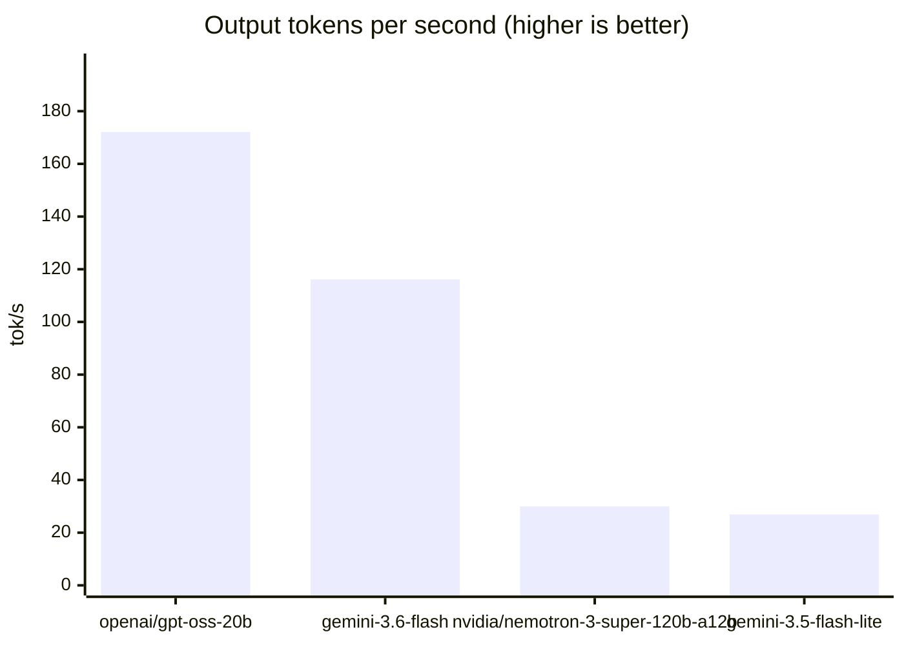
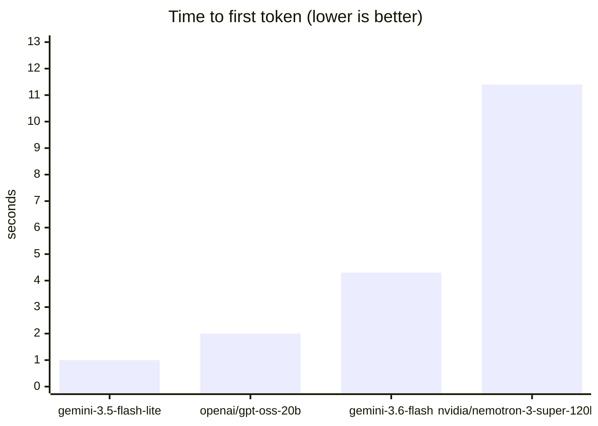

# provider-probe: 20260917-045301

4 models, 4 prompts each, 2026-09-17 05:22 UTC.

One machine, one day, a free tier. The ranking is indicative; the absolute numbers will not reproduce elsewhere.

Langfuse session `probe-20260917-045301`.

## Recommendation

**Use `gemini-3.5-flash-lite` (google_genai).** It answered every scored prompt correctly, failed no calls, and reached a first token in 1.04s on average — the fastest of the models that were also right.

The rule: correctness first, then time to first token. A model that is quick and wrong is worse than none, and on the hot path a customer is waiting, so the tie-break is latency rather than throughput.

What this rule cannot see: daily quota. It counts the calls in this run and nothing else, so a model that is fastest over a handful of prompts may still be the wrong choice for an evaluation sweep of a few thousand. Check the failures below for quota refusals before committing to a provider for bulk work.

Also correct, and slower: `openai/gpt-oss-20b` (2.02s).

Not recommended from this run:

- `gemini-3.6-flash` — 2 call(s) failed
- `nvidia/nemotron-3-super-120b-a12b` — 1 scored prompt(s) wrong

## Summary by model

| model | provider | scored | ok | failed | mean ttft s | mean tok/s |
|---|---|---|---|---|---|---|
| `gemini-3.5-flash-lite` | google_genai | 2/2 | 4 | 0 | 1.04 | 27 |
| `gemini-3.6-flash` | google_genai | — | 2 | 2 | 4.34 | 116 |
| `nvidia/nemotron-3-super-120b-a12b` | nvidia | 1/2 | 4 | 0 | 11.35 | 30 |
| `openai/gpt-oss-20b` | groq | 2/2 | 4 | 0 | 2.02 | 172 |

## Charts







## Scored prompts

| model | prompt | result | detail |
|---|---|---|---|
| `gemini-3.5-flash-lite` | reasoning | pass | — |
| `gemini-3.5-flash-lite` | extraction | pass | — |
| `gemini-3.6-flash` | reasoning | error | GoogleAPIError: 503 UNAVAILABLE. {'error': {'code': 503, 'message': 'This model is currently experie |
| `gemini-3.6-flash` | extraction | error | OutputParserException: Failed to parse OrderExtraction from completion {"ten_khach": "Lan"}. Got: 5  |
| `openai/gpt-oss-20b` | reasoning | pass | — |
| `openai/gpt-oss-20b` | extraction | pass | — |
| `nvidia/nemotron-3-super-120b-a12b` | reasoning | pass | — |
| `nvidia/nemotron-3-super-120b-a12b` | extraction | FAIL | ten_khach='Chị Lan' (want 'Lan') |

## Every call

| model | prompt | ttft s | total s | in tok | out tok | tok/s |
|---|---|---|---|---|---|---|
| `gemini-3.5-flash-lite` | reasoning | — | 1.67 | — | — | — |
| `gemini-3.5-flash-lite` | extraction | — | 1.38 | — | — | — |
| `gemini-3.5-flash-lite` | vietnamese | 1.08 | 1.17 | 51 | 30 | 26 |
| `gemini-3.5-flash-lite` | instruction | 1.01 | 1.14 | 47 | 32 | 28 |
| `gemini-3.6-flash` | reasoning | — | — | — | — | — |
| `gemini-3.6-flash` | extraction | — | — | — | — | — |
| `gemini-3.6-flash` | vietnamese | 4.57 | 4.61 | 51 | 508 | 110 |
| `gemini-3.6-flash` | instruction | 4.12 | 4.16 | 47 | 508 | 122 |
| `openai/gpt-oss-20b` | reasoning | — | 1.63 | — | — | — |
| `openai/gpt-oss-20b` | extraction | — | 2.82 | — | — | — |
| `openai/gpt-oss-20b` | vietnamese | 2.38 | 2.40 | 119 | 214 | 89 |
| `openai/gpt-oss-20b` | instruction | 1.65 | 1.69 | 118 | 432 | 255 |
| `nvidia/nemotron-3-super-120b-a12b` | reasoning | — | 5.98 | — | — | — |
| `nvidia/nemotron-3-super-120b-a12b` | extraction | — | 3.70 | — | — | — |
| `nvidia/nemotron-3-super-120b-a12b` | vietnamese | 4.10 | 4.40 | 66 | 196 | 45 |
| `nvidia/nemotron-3-super-120b-a12b` | instruction | 18.61 | 20.01 | 64 | 308 | 15 |

## Failures

- `gemini-3.6-flash` reasoning: GoogleAPIError: 503 UNAVAILABLE. {'error': {'code': 503, 'message': 'This model is currently experiencing high demand. Spikes in demand are usually temporary. Please try again later.', 'status': 'UNAVAILABLE'}}
- `gemini-3.6-flash` extraction: OutputParserException: Failed to parse OrderExtraction from completion {"ten_khach": "Lan"}. Got: 5 validation errors for OrderExtraction
thanh_pho
  Field required [type=missing, input_value={'ten_khach': 'Lan'}, input_type=dict]
    For further information visit https://errors.pydantic.dev/2.13/v/

## Answers

### reasoning — Compound arithmetic with a plausible wrong answer

> Một cửa hàng giảm giá 20%, sau đó giảm thêm 10% trên giá đã giảm.
> Khách nói như vậy là được giảm tổng cộng 30%. Khách nói đúng hay sai?

**gemini-3.5-flash-lite**

```
{
  "khach_noi_dung": false,
  "muc_giam_thuc_te_phan_tram": 28.0,
  "giai_thich": "Khách nói sai vì lần giảm thứ hai áp dụng trên giá đã giảm của lần thứ nhất chứ không tính trên giá gốc. Tổng mức giảm thực tế là 28%."
}
```

**openai/gpt-oss-20b**

```
{
  "khach_noi_dung": false,
  "muc_giam_thuc_te_phan_tram": 28.0,
  "giai_thich": "Đầu tiên giảm 20% rồi giảm thêm 10% trên giá còn lại. Tính toán: 0.8×0.9=0.72, tức là giảm 28%."
}
```

**nvidia/nemotron-3-super-120b-a12b**

```
{
  "khach_noi_dung": false,
  "muc_giam_thuc_te_phan_tram": 28.0,
  "giai_thich": "Giảm giá liên tiếp được tính bằng cách nhân hệ số còn lại sau mỗi lần giảm. Giảm 20% => giá còn 80% (=0,8). Sau đó giảm thêm 10% trên giá đã giảm => giá còn 90% của 0,8 (=0,9 × 0,8 = 0,72). Giá cuối cùng là 72% giá gốc, tức là giảm tổng cộng 1 – 0,72 = 0,28 = 28%."
}
```

### extraction — Pulling structured fields out of a Vietnamese sentence

> Trích thông tin từ câu sau:
> "Chị Lan ở Đà Nẵng đặt 2 cái áo size M màu xanh, tổng 350 nghìn."

**gemini-3.5-flash-lite**

```
{
  "ten_khach": "Lan",
  "thanh_pho": "Đà Nẵng",
  "so_luong": 2,
  "size": "M",
  "mau": "xanh",
  "tong_tien_vnd": 350000
}
```

**openai/gpt-oss-20b**

```
{
  "ten_khach": "Lan",
  "thanh_pho": "Đà Nẵng",
  "so_luong": 2,
  "size": "M",
  "mau": "xanh",
  "tong_tien_vnd": 350000
}
```

**nvidia/nemotron-3-super-120b-a12b**

```
{
  "ten_khach": "Chị Lan",
  "thanh_pho": "Đà Nẵng",
  "so_luong": 2,
  "size": "M",
  "mau": "xanh",
  "tong_tien_vnd": 350000
}
```

### vietnamese — Natural Vietnamese register and politeness, judged by reading

> Viết lại câu sau cho tự nhiên và lịch sự theo văn phong nhân viên bán
> hàng người Việt, giữ nguyên ý, chỉ trả về câu đã viết lại:
> "Sản phẩm này hết hàng rồi, anh đợi đi."

**gemini-3.5-flash-lite**

```

```

**gemini-3.6-flash**

```

```

**openai/gpt-oss-20b**

```
Xin lỗi anh, hiện tại sản phẩm này đã hết hàng, anh vui lòng đợi xem khi có sẵn.
```

**nvidia/nemotron-3-super-120b-a12b**

```
Sản phẩm này hiện đang hết hàng, anh/chị vui lòng chờ một chút nhé.
```

### instruction — Obeying hard constraints instead of padding, judged by reading

> Nêu ba lợi ích của việc ngủ đủ giấc.
> Ràng buộc: đúng 3 gạch đầu dòng, mỗi dòng tối đa 8 từ,
> không có câu mở đầu, không có câu kết luận.

**gemini-3.5-flash-lite**

```

```

**gemini-3.6-flash**

```

```

**openai/gpt-oss-20b**

```
- Tăng cường trí nhớ và học tập.  
- Cải thiện tâm trạng, giảm căng thẳng.  
- Hỗ trợ hệ miễn dịch, ngăn ngừa bệnh.
```

**nvidia/nemotron-3-super-120b-a12b**

```
- Cải thiện trí nhớ và tập trung.
- Tăng cường hệ miễn dịch, giảm bệnh.
- Cân bằng hormon, giảm stress.
```

