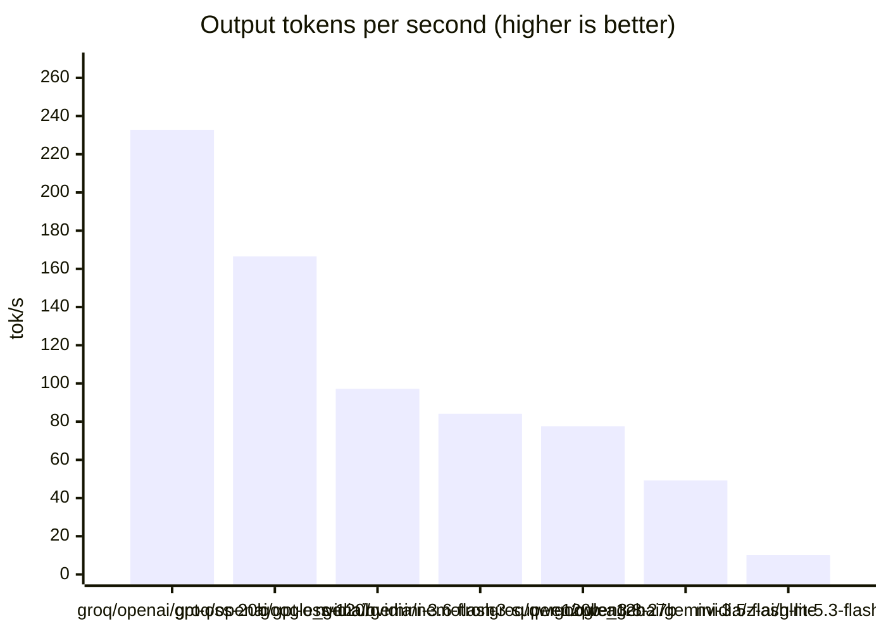
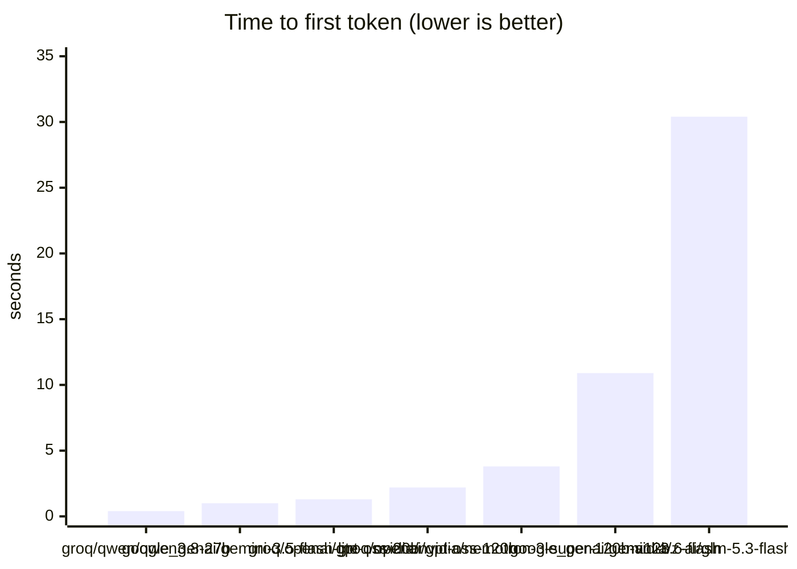

# Provider probe 20260917-043103

Generated 2026-09-17 04:43 UTC. 9 models, 4 prompts each.

Measured on one machine, on one day, on a free tier. Treat the ranking as indicative and the absolute numbers as not reproducible elsewhere.

Langfuse session `probe-20260917-043103`.

## Summary by model

| model | ok | failed | mean ttft s | mean total s | mean tok/s |
|---|---|---|---|---|---|
| `google_genai/gemini-3.5-flash-lite` | 4 | 0 | 0.96 | 1.15 | 49 |
| `google_genai/gemini-3.6-flash` | 4 | 0 | 10.88 | 10.91 | 97 |
| `google_genai/gemini-3.8-flash` | 0 | 4 | — | — | — |
| `groq/openai/gpt-oss-120b` | 4 | 0 | 2.24 | 2.32 | 167 |
| `groq/openai/gpt-oss-20b` | 4 | 0 | 1.26 | 1.30 | 233 |
| `groq/qwen/qwen3.8-27b` | 4 | 0 | 0.42 | 0.59 | 78 |
| `nvidia/moonshotai/kimi-k3` | 0 | 4 | — | — | — |
| `nvidia/nvidia/nemotron-3-super-120b-a12b` | 4 | 0 | 3.85 | 4.00 | 84 |
| `nvidia/z-ai/glm-5.3-flash` | 4 | 0 | 30.38 | 33.62 | 10 |

## Charts







## Every call

| provider | model | prompt | ttft s | total s | in tok | out tok | tok/s |
|---|---|---|---|---|---|---|---|
| google_genai | `gemini-3.8-flash` | reasoning | — | — | — | — | — |
| google_genai | `gemini-3.8-flash` | vietnamese | — | — | — | — | — |
| google_genai | `gemini-3.8-flash` | json | — | — | — | — | — |
| google_genai | `gemini-3.8-flash` | instruction | — | — | — | — | — |
| google_genai | `gemini-3.5-flash-lite` | reasoning | 1.14 | 1.42 | 59 | 93 | 65 |
| google_genai | `gemini-3.5-flash-lite` | vietnamese | 0.86 | 1.01 | 51 | 30 | 30 |
| google_genai | `gemini-3.5-flash-lite` | json | 0.88 | 1.02 | 96 | 75 | 73 |
| google_genai | `gemini-3.5-flash-lite` | instruction | 0.98 | 1.15 | 47 | 33 | 29 |
| google_genai | `gemini-3.6-flash` | reasoning | 4.13 | 4.15 | 59 | 508 | 122 |
| google_genai | `gemini-3.6-flash` | vietnamese | 4.19 | 4.21 | 51 | 508 | 121 |
| google_genai | `gemini-3.6-flash` | json | 3.89 | 3.95 | 96 | 508 | 128 |
| google_genai | `gemini-3.6-flash` | instruction | 31.33 | 31.34 | 47 | 535 | 17 |
| groq | `openai/gpt-oss-120b` | reasoning | 5.52 | 5.66 | 126 | 177 | 31 |
| groq | `openai/gpt-oss-120b` | vietnamese | 1.08 | 1.11 | 119 | 186 | 168 |
| groq | `openai/gpt-oss-120b` | json | 1.15 | 1.25 | 162 | 281 | 225 |
| groq | `openai/gpt-oss-120b` | instruction | 1.19 | 1.25 | 118 | 302 | 242 |
| groq | `openai/gpt-oss-20b` | reasoning | 1.51 | 1.58 | 126 | 313 | 198 |
| groq | `openai/gpt-oss-20b` | vietnamese | 0.91 | 0.92 | 119 | 213 | 232 |
| groq | `openai/gpt-oss-20b` | json | 1.41 | 1.46 | 162 | 302 | 206 |
| groq | `openai/gpt-oss-20b` | instruction | 1.23 | 1.25 | 118 | 368 | 295 |
| groq | `qwen/qwen3.8-27b` | reasoning | 0.78 | 1.07 | 68 | 67 | 63 |
| groq | `qwen/qwen3.8-27b` | vietnamese | 0.31 | 0.43 | 60 | 22 | 51 |
| groq | `qwen/qwen3.8-27b` | json | 0.30 | 0.52 | 102 | 74 | 143 |
| groq | `qwen/qwen3.8-27b` | instruction | 0.30 | 0.33 | 56 | 18 | 54 |
| nvidia | `nvidia/nemotron-3-super-120b-a12b` | reasoning | — | 3.58 | — | — | — |
| nvidia | `nvidia/nemotron-3-super-120b-a12b` | vietnamese | 1.91 | 2.41 | 66 | 187 | 78 |
| nvidia | `nvidia/nemotron-3-super-120b-a12b` | json | 2.53 | 2.91 | 116 | 298 | 103 |
| nvidia | `nvidia/nemotron-3-super-120b-a12b` | instruction | 7.11 | 7.11 | 64 | 512 | 72 |
| nvidia | `moonshotai/kimi-k3` | reasoning | — | — | — | — | — |
| nvidia | `moonshotai/kimi-k3` | vietnamese | — | — | — | — | — |
| nvidia | `moonshotai/kimi-k3` | json | — | — | — | — | — |
| nvidia | `moonshotai/kimi-k3` | instruction | — | — | — | — | — |
| nvidia | `z-ai/glm-5.3-flash` | reasoning | 16.22 | 24.23 | 67 | 215 | 9 |
| nvidia | `z-ai/glm-5.3-flash` | vietnamese | 45.50 | 46.87 | 60 | 399 | 9 |
| nvidia | `z-ai/glm-5.3-flash` | json | 21.36 | 23.36 | 104 | 328 | 14 |
| nvidia | `z-ai/glm-5.3-flash` | instruction | 38.44 | 40.02 | 59 | 366 | 9 |

## Failures

- `google_genai/gemini-3.8-flash` reasoning: GoogleRateLimitError: Error calling model 'gemini-3.8-flash' (RESOURCE_EXHAUSTED): 429 RESOURCE_EXHAUSTED. {'error': {'code': 429, 'message': 'You exceeded your current quota, please check your plan and billing details. For more information on this error, head to: https://ai.google.dev/gemini-api/do
- `google_genai/gemini-3.8-flash` vietnamese: GoogleRateLimitError: Error calling model 'gemini-3.8-flash' (RESOURCE_EXHAUSTED): 429 RESOURCE_EXHAUSTED. {'error': {'code': 429, 'message': 'You exceeded your current quota, please check your plan and billing details. For more information on this error, head to: https://ai.google.dev/gemini-api/do
- `google_genai/gemini-3.8-flash` json: GoogleRateLimitError: Error calling model 'gemini-3.8-flash' (RESOURCE_EXHAUSTED): 429 RESOURCE_EXHAUSTED. {'error': {'code': 429, 'message': 'You exceeded your current quota, please check your plan and billing details. For more information on this error, head to: https://ai.google.dev/gemini-api/do
- `google_genai/gemini-3.8-flash` instruction: GoogleRateLimitError: Error calling model 'gemini-3.8-flash' (RESOURCE_EXHAUSTED): 429 RESOURCE_EXHAUSTED. {'error': {'code': 429, 'message': 'You exceeded your current quota, please check your plan and billing details. For more information on this error, head to: https://ai.google.dev/gemini-api/do
- `nvidia/moonshotai/kimi-k3` reasoning: ReadTimeout: HTTPSConnectionPool(host='integrate.api.nvidia.com', port=443): Read timed out. (read timeout=60.0)
- `nvidia/moonshotai/kimi-k3` vietnamese: ReadTimeout: HTTPSConnectionPool(host='integrate.api.nvidia.com', port=443): Read timed out. (read timeout=60.0)
- `nvidia/moonshotai/kimi-k3` json: ReadTimeout: HTTPSConnectionPool(host='integrate.api.nvidia.com', port=443): Read timed out. (read timeout=60.0)
- `nvidia/moonshotai/kimi-k3` instruction: ReadTimeout: HTTPSConnectionPool(host='integrate.api.nvidia.com', port=443): Read timed out. (read timeout=60.0)

## Answers

### reasoning — Compound arithmetic with a plausible wrong answer

> Một cửa hàng giảm giá 20%, sau đó giảm thêm 10% trên giá đã giảm.
> Khách nói như vậy là được giảm tổng cộng 30%. Khách nói đúng hay sai?
> Giải thích ngắn gọn trong 2 đến 3 câu.

**google_genai / gemini-3.5-flash-lite**

```
[{'type': 'text', 'text': 'Khách nói **sai**. \n\nLần giảm giá thứ hai (10%) được tính trên giá đã giảm của lần thứ nhất, chứ không phải trên giá gốc. Do đó, tổng mức giảm thực tế chỉ là **28%** (giả sử giá ban đầu là 100%, giá sau khi giảm hai lần là $100 \\times 80\\% \\times 90\\% = 72\\%$).', 'index': 0, 'extras': {'signature': 'El4KXAERTTIPtkcudkQYzrHOQPG2SN/H1QImWyzQYkSqDm6peQjmXhOCf4IQZxD+C7eY1SFd8UIcfKtE+YzrNFesOFwab6kO2Bl94pX3ifMyS4Nm4R7/Jk5VbbM8Om7p'}}]
```

**google_genai / gemini-3.6-flash**

```
[{'type': 'text', 'text': ' (Checking against constraints):**\n    *   *Accuracy:* Correct (28% vs ', 'index': 0, 'extras': {'signature': 'ErsQCrgQARFNMg9E/TH7LhEVIDMipydsWBOIT02Eo5HJBx98n6qF2CGXfrQoGbjXfPPwNL4p/XTHMaGPjlE61DmfMpaO0kisMwduN2o1cHBoYtEKeYWrHYTKch16dHLBQdVNWzsGsga77udDhi/vjiobE0gpO0FJ50dRcaRsaLlOsO4k9TwSbK6Ubf3FWGOBTWXC6QaDOOBKe8tUbWKdGdXUjk6IiYy9xZykuCG36s1pCWJUbTmFEw0lS50Xuk0Jp5BTfta7n4/eRB2nUd+GArOz2J2IseYXvRygE1HmvN9UcpUAnJiUeLZdg3DWbaTW9ak9X3WzILlSg3I747iRut7KxTKjW3T89OzHiaQdfmiubmXbnbc0Y9ijORCZUBL3kH8a2Uer/DKTzXCKkm4galv+/2KaBOOnYUoKrHtFGi4Zp9YP7fyef24nsfXZBwJWCjxmTh+SXDPWuEbXlCZZ3sWe2ThtE+k1gl2UFSEg9Hjic8Dvr9OkUHi5kr6+MY5Kkv6+jCA0632HF62WPiJa/vJl8qV60HpvwJhb1iamrO0u+mR/XqpcGgj+XlJ/pekOOWo09a7r66w5re5kd2BLx4WECsLTai7gftfUcwjZK+Bz42T1vlTgycg7sz7lhrRp+ebs59AShDDw1Qa7GZCrfx3yJCdIKCfd7OPTMbGT5agghKnQrZsWDDsbGX7m/dzFAx2ckcPP+DRPr4EPkJVDjSAmHYvXc9U6mKcYE9ChZDrMwYOrVEfa0E97o/IvJu478eL9I6WLtxJhhtVMcYqxg13rbqd2kta6DDpAN4aZR4O5mUf1/vmzWXKM4D6O+/6NPUwwRjyjlVwlNvJEWaIFGyMNQ7ejEk45FANTx/Ath9AJmOtenAw31iavSjFly2hcdmXswsDzTdz0JAhlIUv+Wduyn1OJ6aPlbpr1d916CH6RkU/H/g2OqOnE8xI1aDCXnH80nPaOY8BasK0GqCG+2xkn+FBPizBdN3xV21pc00eOeETmuwh+5kml9qIFMKpQqn9zFCpB3uFfWi9kGXEHTYO57FYY08WmYJlBotRQgGQ8+UDMlMqEdYW1+8rcxNGlMat6+EjHlAOIisT3+7y4vSeteICzFWSXqFC85V0mmaVn3BqNjX8wU8NNeaviZn8mS6yZIlmZIuePfzl7zPgVkQVaQcAVjEmSJRSG6gZ5xXoV5nJyowagD1e7uR/HwjztLXNNr+JpvAEUoBaZZmW+m5KO8t5mnMNcwN30DzTBvl7LXGOm+kVhSXW05HYughNmJBGhbcCVj0HH8v/ZN7UcNsAaOxqEttraZEAvkwfDznwNy1yhK5CQLzo0v04HnGJ9Os52XM1bDH8EaurCNMJKSJHOpJ2AukcPOwXOt52my53FPMd9OK1hJfLxouWqqZRxL6F5MMCJA7W07pO82IiOYsA5oIvZRJUNgvZPqqqcNEEhk1mYn4M7Rh0+HFSQngtb9xvRDi3QaNl2WPdhAVy2yusQo0wJENRzt3zt6iVE+d3uxmFxpmRrbM3NGTQxTZSQxrCQV/tSsKZX+C72jq5T6NbXv5RZ4a9CSQilhEelUEA+1dkK+iTOt4iyIzAvp0O+KJzF1JiOcm/zgBZV1RzbMP4tH8qh7U/rr0uy6uiF9Vkxj1yNZ4YiCDDpuG/NU9d9hxDcr0PqnfDexnbEeFGOx/wt9JlsOZKuXSSe6clAafKwHfF29ofwnlWXiIuivmNpY0CczLygdDs/tmZhLAEXRgN0XQlVNVwDwEXIWdyQ/+2Y6aYRQ5CYQzI9iXPFcj8hKSItnAy3CS2IKDTnDuT0QAupoUL9gYsIP7vuTQPPogKQLjIQTwmgaMggNHEdT+5aysnQN4DNv8oxaqtw98fcOFUwl9dvwA7tPPvhT8H9YtdI/b2ntLAnwBQJiQJuYVKfA+oyA51gRuX9w8KSswSazFBdoC0jrG5EYsZgcq75wFeZGLQmwicRdWphbBJzz9em1n65feTKsVJpl7Zi8w19M0Zy47kssZDYoEsPVTJPzDFbymXy+Xa0IL4LNXgbWa+KeSV8EmguByxZ6EPdsCpS2P5zNNfTt5YmXPT5ebhkR6ZjN2buxbOR4ZPCe/UpaZN/2iN2kLbxuOYSW2qbg3rF7DDEC+bsX26KpktfIWNosM2MeOfEYWRUgTirzSmazw8lfda0D4rBm+MHitoKQrQSVn9+L2112/aOfKzkC3ucoPB0kzE61ocRKl50NYRX467m3Yw6wXlpaiLjYvAKt8dg8yKl9VFBazfAZb1jNwUag2CHOd9jbdgSMvlQhnmxB5Cer4CfR3mCNef76atFB6af3O/zXA12h6J50q0OWgaVxHfBZUY36hqAweGTYVzTFdx7ySh1Qz2uqtrwp49eJppyVJDNRUoHvlCg8TAyBlLMxXv3JjcmbC+EnLFOGZpDt4UVwtyiY5/hSpA8a664mAAef1ZexjIjbg2eG0Xp4q+iG47SL2rgoxQx3YukdkdBUblHliKj0odgP5EXO3zJxBfOqran4Cxo6aotny8ajJa/SmG9h3mH9C9C47e+1/6x7tW+RXe7ey/r87aG/HJijCa1H+Ko0g7Zr96OQpVzNpmN0xkPtyCzWwL2q5Y3SO4Veixz3G7Aq4CWnPfOhzjgUuCTtM1IrcxPPnGcXtXhxJhMygZrJkFxZ/spAMnzXdddxV7uXpDMw9e9NIxF912n0qteMlV85oDcUzWGCISLGx+CiVXRbzahLjUv6iDuc0A4tKJzMxm/uGd0SvEWMQf/J15XGDp5PGMYD1uiqTbXubcwVCrpFxxWZZ7601oHpiiJdg=='}}]
```

**groq / openai/gpt-oss-120b**

```
Sai. Giảm 20 % rồi còn giảm 10 % trên giá đã giảm tương đương giá cuối cùng = 0,8 × 0,9 = 0,72 của giá gốc, tức là giảm tổng cộng 1 – 0,72 = 28 %, chứ không phải 30 %.
```

**groq / openai/gpt-oss-20b**

```
Khách nói sai.  
Sau khi giảm 20 % giá còn 80 % (0.8), giảm thêm 10 % trên số còn lại làm giá thành 90 % của 0.8, tức 0.8 × 0.9 = 0.72.  
Vậy giá cuối cùng là 72 % so với giá gốc, nên tổng giảm chỉ là 28 % (không phải 30 %).
```

**groq / qwen/qwen3.8-27b**

```
Khách nói sai vì hai mức giảm giá được tính theo phương pháp lũy tiến, không phải cộng trực tiếp. Giá cuối cùng còn lại là $80\% \times 90\% = 72\%$ của giá gốc, tương ứng với mức giảm thực tế là $28\%$.
```

**nvidia / nvidia/nemotron-3-super-120b-a12b**

```

```

**nvidia / z-ai/glm-5.3-flash**

```
**Khách nói sai.**

Ví dụ giá ban đầu là 100.000đ: giảm 20% còn 80.000đ, sau đó giảm thêm 10% trên 80.000đ tức là giảm 8.000đ, còn lại 72.000đ. Như vậy tổng mức giảm thực tế là 28.000đ, tức chỉ 28% chứ không phải 30%, vì mức giảm thứ hai tính trên giá đã giảm chứ không phải trên giá gốc.
```

### vietnamese — Natural Vietnamese register and politeness

> Viết lại câu sau cho tự nhiên và lịch sự theo văn phong nhân viên bán
> hàng người Việt, giữ nguyên ý, chỉ trả về câu đã viết lại:
> "Sản phẩm này hết hàng rồi, anh đợi đi."

**google_genai / gemini-3.5-flash-lite**

```
[{'type': 'text', 'text': 'Dạ, sản phẩm này hiện tại bên em đang tạm hết hàng, anh/chị vui lòng chờ thêm giúp em một chút nhé ạ!', 'index': 0, 'extras': {'signature': 'El4KXAERTTIPaZm41pxuDZv+ZncV91M+TmJYmCTfxzzO5zsgmuAbbpIyRVmgQGyi+u7rJs/zjmtoFdpRKjo1mKs//1ubcDA1Ezelok4ne7RpCIRiOWCmq5kqYNQpLgGg'}}]
```

**google_genai / gemini-3.6-flash**

```
[{'type': 'text', 'text': 'Refining for maximum naturalness and politeness:**\n    "Dạ, sản phẩm', 'index': 0, 'extras': {'signature': 'Eu8SCuwSARFNMg8Sm+A9LRlJDPygmnGB8sadO/p9Vg1oGqV2yYo3Cbs2HCuaGp5wRs/gqb3PInV/H2tj97C/bOXjlSmhds+JD8vKZjDtApcHu5Qik7vZLiZK4yVuB1V6lt25GsbGBQIZBOOxjoQRWNMWKerCGfo0+zjlswVXFA61eoDMwrUyKRafO+Q5mTWdNJuagYqlvfEmN37V10bC5HX8DM6Cvsiyc9ybmKvowqnhLeNeBYdeg3UFjGf891faDNurGEP2MoxqK9e+AgopEniJYFJ7t6w2tDRXwlMtmBqY79P1tDyB+IpMporJKYzcpHUAHcXQtaB/3a0QMwX7xN4cDH5fF3zLQJJGOXQWhK7cMYdnJ/AgVuM6+ZrGSrX4s/jUKetmxX6GQT4LLOEzGL6nsueSpgH8EG78oqOBgFyqqljDnN5mWQ9HOYZQorTLGqdltlsrIZZ3yDKcXQJIjk4Kw6xJHnFv45NXd3TZgbcMnO/1BmsXTpdoONu2eC6U5xgvj9BVUnde1GxDiWkobrNLzsNECVN/sDIrNs35fbIMYtorYAIanLCpPED50dXcICJVLn/SXKzKYuwOSNn8FbwX967NYzgtyFeo7zie+2+t7rCcRU10qjzl23NMX9WEPt1pTQRkv3VVCD9VXr3CWePEanzB2/l1L4rFlGiIfz4Xsuzja7co0gNn3dBsJg2vs87gRmbylBubhUTevCmgJVIdTbpS5DRMIglX6Jns4KqOJKPG/VCT4hvjIiMTqfNk/9opLp/4cuRJbpU1TSg5LxnB9QaTQYzBtpahDBh2T3G5EPKk56VRjE4Ue+SBCarsgPhTKVpwm20pJwEii/ueZhmu23JI8LBjauCk+F2YlVplzcg8UnUtZQj9ext2aGEtYi9b+U+GKnoy64ESr0OURTpZ8RMCwLPCEHofYXD/oAZCxkNtnxChYosUU2a/XkcgxjzPJoOcrcv0hbwgukR4OD3H2xKFRWPW88VNPhDRYIzz/cmJkUvAJbjdLYpWytk/t9f8hLjZRZDhKV5HljjtQ093Oav9tMkywS/M43yDn6lH0Q1oaVWS6KzbwGT3V92WvaHiKDLJJkF8Gq85JHAkVs1jE5XqJNYjG7xz5HE3qRE723CwznpLUmV2KIgcxY8YEqHT+mLp1eEhpWU95Eed7g5nuDnSEI7aGIaNwph8ZYbJENN/mO+MY6M+tOzAfeTDuzOqUq5QK+ZM248Z7elo7NoAat0K02ypFXdAFRnXuXOdRRCmHJBGo1TH4EViNvwHQaj0b5R2fVSu1yeb6SqYGyAh5PpaeddRSVYI1F1bMimSNrrJGDRt+eTJqOqZAz9zZY/07UFRNEYNeh9EFFUlkJj2Fsj0upR+l72MKMYz7aFY9AFvNTiLfhHNfF/iVw4fCi+aR2+y5TCEp+BaF1R0wsKPUnym7iWeXYWYqRXxYyYta4mFpGDiA2drMraynEJuNmzCvHOjHb+/bIBLIoFVzgeeJbA5oK/AhNKEN8LtBSSKd52GSGH/aNaa7hizL8AJse/fqlQpc/X5YW5vbBqRjMzoxhtvFXrLMKNnC89prXPDcNXQKKgbt+xc3IH9liyoDVErVibMLiCFNEypNx4PL43fIpCaI9lOCk09t8bB/Z5qWxi8FS/bQdkyrUj38k6pkCmAK3sykD2ftvdUHmIe7zvPaxXZffuTiY2u2d2uawkVYeVP4z0l7dx+o521/3yJ+X3L5fKN87phnAbpdegv1S7GIkblvC4jyct5FKAURxBFYQR4+XEDjl9iMy3sSUo9dC3o9OIMWJombZgPMxyr1bnUefx/BaiHBRGMYY9pM/WVPG3xrWPcz3X/Zv7jJY8WRJ/MwSxU8hEk3quSrtMaGEag4XYyhtjVo5JYik8LliflbRT+ye5udv1RHwGc3aNY+0XQT8ixA1/f6Tp1fyroGvI+/Us9U/jEzWK5hzPqDnouonI6Qq+ZS87U05+Cqh4S6/uXUeSWlFNBtI+1dCWs8tkLb54Fkm9hIJSuljN83+Ie1XIUoGOqYDwGc1EY/FVoXDnDfn7biSP1QhQM8lmWz9is6pglaCAQh2tKinwuzAbKcNFKAmKz2eyUg1Aqn0mxQYEJ7ZaSlip5QSXFU2D334Otsfm5f1rP5addobqhRUVhFgRgXwD8o8GHalXA/Q8mJ2xRGVoHsNV3Pi6XgQgVNKYjRrNIREHHr2l08uh8iPpEdWnNT+K6LLsSG84DB0amZzjtqlqgzMi7vxy/nX7fl4Xb0LGw4ExFYi6FzFZ079Y4TR2d3j1TsjOR0fQ9KlkOScAYJmJ/qI2wntEhI9gFqfKZWFHrdAvXfC55ko9uoPRTdK0ckCMDySJlYDaYj0k0bAUm36wxcOVR4qbPtgpjTXgy6y9YQgFmXEPlwjlJUBcF7OesHpb5fQQ2D+yfvTxSDJGcbFo7QfU9FjAxm1H5ALVaMdFU/n+gHv6gDDeedcwY/uQDyuPjW4Z5uRYp4iSquJcXXZ5bTM7Uu9eVcgr5d6I92WZycCAFg+zMo/9QMKHmfBqUFsBq8BpVmWv38a6pTZHuCsWE+KqJtyOpVPzhqL6ylu8ToApuKE32DPDD0xy0xJUmBPH4DpIxWEi6mSkQXr4zq959ws38Lrk9G3/70s/FH4FoayoSyTuP2RZcOLXn5jnoHDOjkN7Rik+EGFwmW0KC8LLKzVTIpKrOCZRLcod1jRnkEgSUoA2jjCoZzuwSMkTNQJEhQjA4DBwDeZqYIfyf1EVzTo6TwgEG4CeznG6WWfitcfuJ1kMX6mU254uYLc7wkftoeJrluBkqZcUBG86sjz3+tjypwUNZbqyXanQvwxX1JoWnSHDOtUrLc1DspK65RIBU4Z62f2Ku7bHu1+b30p5SExVoGeXgWu7PINjPK7ovjM2bB+jWIbNg8m44dZojelBDJfwrO7dA0CUP3UaqW43Tjck/dWM9TBg0VXnKoadcgPSpV7iabkWo+CMd0SCG7S/ILHmFgsJhUVJeFMJTmYYReKU5wY2MLtmcI96aYq9yGVrNEu8mwXeoSJqMHFvLnMXXOIq1k77dat1t+WTbKMHLOgCJh3bPAZ5VbnmfuaHYj+snAW6WDdz44zTDTyPNVVafKvN7WI/keITcuqC3vYvD5GheU6jB3LNUzVeh2EGzIbi2eGR0pqQe4LXUV1auIpFPo9+ZFFUYP+puf/SwlsICx5gWVyXyQ6korWLq'}}]
```

**groq / openai/gpt-oss-120b**

```
Xin lỗi anh, hiện tại sản phẩm này đã hết hàng. Anh có thể vui lòng chờ trong giây lát được không ạ?
```

**groq / openai/gpt-oss-20b**

```
Xin lỗi anh, hiện tại sản phẩm này đã hết hàng, anh vui lòng chờ đợi một chút.
```

**groq / qwen/qwen3.8-27b**

```
Dạ, sản phẩm này hiện đang hết hàng rồi ạ. Anh vui lòng chờ một chút nhé!
```

**nvidia / nvidia/nemotron-3-super-120b-a12b**

```
Sản phẩm này hiện đang hết hàng, anh/chị vui lòng đợi chút nhé, tôi sẽ thông báo ngay khi có hàng, ạ.
```

**nvidia / z-ai/glm-5.3-flash**

```
Dạ em xin lỗi anh, sản phẩm này bên em hiện đã hết hàng ạ. Anh cho em vài phút kiểm tra xem, khi nào có hàng em sẽ báo anh ngay ạ.
```

### json — Following an exact output shape

> Trích thông tin từ câu sau và chỉ trả về JSON, không kèm giải thích,
> không kèm dấu ```:
> "Chị Lan ở Đà Nẵng đặt 2 cái áo size M màu xanh, tổng 350 nghìn."
> Các khoá bắt buộc: ten_khach, thanh_pho, so_luong, size, mau,
> tong_tien_vnd. tong_tien_vnd phải là số nguyên.

**google_genai / gemini-3.5-flash-lite**

```
[{'type': 'text', 'text': '{\n  "ten_khach": "Chị Lan",\n  "thanh_pho": "Đà Nẵng",\n  "so_luong": 2,\n  "size": "M",\n  "mau": "xanh",\n  "tong_tien_vnd": 350000\n}', 'index': 0, 'extras': {'signature': 'El4KXAERTTIPyl9lciPPdiUNDihiptkD0F9auq7RQSvxfdl7d6w8UKPdcB3NUSylBWCsBs/AzNtAcXS9Ys+rUQqLORWQiqYW+f7m/nXsFrtqf/CfoKRcOeQ4giOBlf39'}}]
```

**google_genai / gemini-3.6-flash**

```
[{'type': 'text', 'text': '{"ten_khach": "Lan", "thanh_pho": "Đà N', 'index': 0, 'extras': {'signature': 'EpAPCo0PARFNMg9Qug1p/8/eH3r6IFG/Y60B6f0whuKt8fsx+z/T80HrgSCBaQeltWitZtQ2Kq22FD4TWlJ21nGf5MiJOPakyk4yGUlDn0JWdDngCrJ4S58VO+nOFVn1BYLAiI4o7a72Bnf1fxABVAQj+shncvmzrEJHHMkr9BHJst9OI/U2nnHUuyGqvE4KS73dYbfjj9DIxNWeRGz/9My5URXnqKwY4BilPZAxxXV3Zbru00uIElrWBsFFb/vO4ybyfD5mA6IaNllZ/4F+WSjpf+G6/3XZI5y7VdY7lujUjNW5bhgrrhPfotLE7EPSyIM6Gb1Aav3TB/5krecGO9MZRVMxtnzu1sC/s/aEvwdOuKqoIJnYK4c/i9yn2+tZFCFuXqi9GVBdvKkfp0g2SFA7FroSSU5Dteiwyb8SgnjcnOMRVd505P9bQ/WSzAoC9ElhYV4JIbJmZbucfY8rwP6H3MsPqnL9kDPnaMxHUZxB7Ng6GKegwabJ6Thy3S06RCKMHamtjI+cVT+fpio13AjUriGUAmXpzY3eb69a3t/FD/OvHb/E/dFM66aNML72bHx56OIv91NgvGkoyqyTJIQtFDpOgOaNplELCCoI2+U03cAmgH46Th7n/8ukEXofdm9x04s+Q1hM5DRaJMkIneLbt4O3+i/S4EWj00B2D+QeG+jDtAKPr+SnwrTxn1Cgm6sh1oMsE3kMMUoNq9UVUqrAEHBYehdE2qB44AEz8ETJzTsTctYzzX3VqqW8+SlSajvZIL5u2WzeUpzH7cdIQcN+v4JCqbCH41rWlyI80kBaHbTSPqYAXe1R94eO3RAE6bTBwbwmPopyAom5kqG8O7z7gVyFkqBpDdGmSd/0j4ySt5/CsQX2CtQ58qlWBBKhGcAVsrz266jzK4OQc8Qm96ZNOeefHTKjZ2IJKRa754OGjxwu97c6XlRUNSduZEmOU9Z0DaTtCii0RZDMxu2w4sIIetERYyIsUvszjQGbzlpIoJoGsvxd2u+riLTEm4nypI89dJe1zuTQ3X+/PW2z5XOvmYVPKg+yDo8q/kg4nR44xeS3OyCOpOeJKSkABbFpZzgytxpLcgLl+bJkKCS2l+2g/1eTZN9hi3ha4ilu+03bQwSXjzzVB23M9CMsugV47r7FlA9gIU3hU34BOEUUk63ghbNOIyjL+ypzu5Siu3NZuSXDNCXmSeNwSNYizAaHx9QE1F3YWCwi0mqqB2avSV1eV/fj7w/2SBeMkaEoB+LcscnsstkeSeubKjd0WlolMC0FmPJUSDiSOi35/KM6fZhNmvZ4rhhJx01FqcarhOh16ztw/eYOh+z7+GUzIqTHD9XBbkXyBKuwUuLTpvvz6SO3eI9GBwUWQw6CjgDSys40nE6g1mvhAl88h3S0czt8w9rCcrlOADVWYorxLF4zR8cfDYaISQwyWiRXPWp9OkqPRp3p4F2kciwP+19xk9ady4HquD52D8ZHIfAM/SOP3rgzZUYQj0HZlfr9lqTBHnIRWppBlvitd9lUJfzd0FhJC9/G6+MSodKPD9FkGZTCJICAZLAK7QxmiEASy8NZc+IAVS/9/y/y/Of2jvhRi1/mECS1Yu5dyOtjWy0rVzMGsTXTQvrDjbePoGWzzFAXyVaZFUPsbx5/OiDkqx9+yMkn2s7b7zMb9jy6Zjz95Mw0Qd3DeYVt+y6ErXQihjjJcjNLEOEgw+GMqCbrsxbN7rnGOVAGFW8P7YiBk3Am/o+poB5a20WgPHXEsH9jlLYvCHgU1T+1FoyLnRJLLGy9oe3n3tQj6Uk7YIzkA40dkI3KNk+ext1IN1NxIyG13bcCtQyXJ3NShwNQ6f2Gi3S3Ewk/Yr+UA8tNMP3q8XZoR81JasRLHvyzLgD0T8Wi7gdTvfR2h3BcIYYOxjBG6Ol3I7ZVlZq+BGzIRe+tOuKPhpfl4Lwc0MjrT1irfTy/q7XAhxNidDJWE8xswiMU/fToV/40eapOJiMazG6MLTwER3uaI7S2tQolIZxAxxO0XE2boT/pcuyz/s6u23D7F07aYkC2LEV+6fpSzlG77fn+V+xCDl7Cjs4IF+dWnfLfC7GDlpYUtdq4uzR6WSFRNnn5HlL0BGahGdIqDT8E1D/xbOx86gLIGT0sd3txnZUZwNiZUz5jojxCnJmuWtUykEElH1f+7wCPHparMqSac8bwnzvmDhAWnboVsqXgzqQrfylrrX3OKc7kwGNGpPY+Y+9lFcbRhTYq0SOOd45FwKjGgfWLUtBOJnSEiHwhtMF6BVymSS3L86NDaSXLjirYAoIpdxuLbw2bGlvJk/xDUHKy3kuMw5pPG4avB3lzSRLstq3VoJFdOLt2d3q/miH4nInM9EQTWuhzfPUrs/FoLLses57lFJKHH7pgwsD9K6HsBqW3GhUkjq7tJS22aVHhfAjZMjLSunggvm7+mJlSTQ3LZyF7Lu7avDb7ZI+LIv3xjoGmgL1I39C7VDboDdfgsb5f6hrxpMNx2FCknv+9ZHgstQ2yzG+MY6FYlLO59pxX0sZdl62Pvafb+kBayg0bMNBrTKXv0m3asdet+u2ZQuWBPG94tXYmtQ=='}}]
```

**groq / openai/gpt-oss-120b**

```
{"ten_khach":"Chị Lan","thanh_pho":"Đà Nẵng","so_luong":2,"size":"M","mau":"xanh","tong_tien_vnd":350000}
```

**groq / openai/gpt-oss-20b**

```
{"ten_khach":"Chị Lan","thanh_pho":"Đà Nẵng","so_luong":2,"size":"M","mau":"xanh","tong_tien_vnd":350000}
```

**groq / qwen/qwen3.8-27b**

```
{
  "ten_khach": "Lan",
  "thanh_pho": "Đà Nẵng",
  "so_luong": 2,
  "size": "M",
  "mau": "xanh",
  "tong_tien_vnd": 350000
}
```

**nvidia / nvidia/nemotron-3-super-120b-a12b**

```
{"ten_khach":"Chị Lan","thanh_pho":"Đà Nẵng","so_luong":2,"size":"M","mau":"xanh","tong_tien_vnd":350000}
```

**nvidia / z-ai/glm-5.3-flash**

```
{"ten_khach": "Lan", "thanh_pho": "Đà Nẵng", "so_luong": 2, "size": "M", "mau": "xanh", "tong_tien_vnd": 350000}
```

### instruction — Obeying hard constraints instead of padding

> Nêu ba lợi ích của việc ngủ đủ giấc.
> Ràng buộc: đúng 3 gạch đầu dòng, mỗi dòng tối đa 8 từ,
> không có câu mở đầu, không có câu kết luận.

**google_genai / gemini-3.5-flash-lite**

```
[{'type': 'text', 'text': '* Tăng cường hệ miễn dịch cơ thể.\n* Cải thiện trí nhớ và tập trung.\n* Giảm căng thẳng, ổn định tâm trạng.', 'index': 0, 'extras': {'signature': 'El4KXAERTTIPJshRKL7ytBV9mnFZPb81cASmOLj7ewPO7cVnmaLTSxLhW9ID0+xIVl90ZO/I5417KDzhX8GXsWmakUIeCwlsxrWDaHIOXM1X6EBXhWKuRi+8c7R7mZG6'}}]
```

**google_genai / gemini-3.6-flash**

```
[{'type': 'text', 'text': '', 'extras': {'signature': 'Er0SCroSARFNMg9O8bZxa7c3ZIr4PjbJOzY1ywcZex7xkO1CyH+2BB0gTDvCHeM4h9+up/IzZ2U/zcNLfSvrmgKbEm0X4mgPQ7oTFrBiUa//uK704GDtgkNIcBO3tpqoK81csPOozdatkhICpXbz34XeXFpaFQHl8TEFiBIPirFPVAXbd0LUiXHNzN2Rvd29x0/6FLmyWMz1A811VGICPz2asS212pmycFMk1jgssUMuESwmTAJKEl3Q26C+9IVw+HLzotLJ4lHuZ/wxKi0Gl59mlWmvhYEFI0g6Agy7lBATSLIXqiNzJfxtmq//fkP7lKyeWF/K6tz5TMKu0CWFqa5g956rzIPd90x5HOHWQVL2DMNhsP7bQ31sl54aN1uCFjSkKZ/MxL5YwgjGpI6iFS9mzYEl+TT2gXMk86cOa4YRQWctuFUs7A4PIOBu8YgdfdJO2PVWoPM/nmKhJKmSF9uRlYQIY6NHZkQF2TlR45TOL1ufl46qkYXIC3FGlQRt6+tQfShkzMCpaAqN+gIfTABYghvNnhvreSXWS2aohGlS+DnG4wzVBvCwKWD0/5MFscF4LDmSKjON6UDJqtJPPy8O2eyDcMBNDcMAfUGwDAXBW7CxUsfEYoXF0qXlSBjz8dvVufxB2iIbwEVUatTXnuKA7jRGTAK5j2zP19q++GuwakGqiPXzN2Euv2sKwCs7bohNUQ78RURFbdLoL+K8eXnBHagf9aPq2/VkiMU8UrarKChKM29aqce6Ir60ERv7fjy1i6N/lNXCFJ/dvqWYWJm4pKXlAK6JMkR4+xuOOsW6NDVt7BYkgA8HpYpeEc/5gxPgbtEpKT2xofeJtKZtc6yAZXoB2WuyCKz54TN5eyS33OmCcIZnIFK/c36gnJPZZ99P6wH+zRBn7/vUCFB2WjWc4bre5IHce0eqaYwLc/cnw8dObbNFSSPh0zqC5izzL6MIYnz8yyZ6nc0VghEyJoeSC5LFERKspU6cGwqpONo6eRLsw/uWZ+F5BirwmTTxyfewo14xgZJCEKIef7s8mK4Zfs7NxM2b2Euyrx6q/P1Ej7ulx97voedWDwsmqx9oI/XsN/iVAfT0P866AUIoOcbKsF68iUf9JZxQyy9RTr8LtjKscJLhUD5//MtAVmkhk69SSsa9nCbdMg9dXIhuUEHnrLodOJmXvq+PROtici+P/pN6K4r31HQdw7p0M4/tKax5M8m6ZKVpaJSH27VGCcqXTL3JHrlrRxHn4X5tY8A188ADdDEOCIxUfsL0MO0T4zx9ZK1hKdDVSXygdW9ts0PXPViDHzb3DR2ejfQwzsaUhQM3kpSg4anGZzv7hXzosn2GcCtLxvEKSB4L/O6czMN5Nw+TmyX5Cs18KmLvdEzgLcJGHP6xxylkWxqMtSd4lNez8tZODp/9etyCvHoZRI4rgG4T19HWpYFM6iki3nq08cyamw151lD4B1/kb2CHpFwAdWSO8gQtrCmpHOgDqDab/vP98cBn8F0FztfVYozEuL+lrfv6hvSQHxAF9hE8DZogCA1JKAQviXRImVmgo1WDP+Lv+1nVqNBjMTOMCrdVoLNA+CbO9uhe7yGrlIAw+VsoTOBYmgm1frerGWxbYrf8hvfVjmrsbhnNNY2dZcccbwDU0Mf9M6VyzT++VEnEOpaW/OuoQrHlfrlldbB2t/di6zQIFulevBuzzvcO1GJTY2o3dGIUG2xcBTSxIv5rN8m0Jmf7hMXI4jqAIUAYNNuMa2kEEx3EIeb2vqMq+Tp3UOaQaMTbqlcuLVvCvPicx21OqgogCgNeOjzwV9H9fQ4RTYXXk1zr+/5J1kQHcqSxyAGSuU3CKz8Qd3BY9Co5P/T9I8CWlKHqgfI9nIq6grJNAOwIpH3ufZWKkMBmD+VkDdEaGnZRHtMvgAXaAi8FG3ua5ant5TdYFxUf5kv4Ff9eEUCpEI0CZK61egH+lDjvYMx+7jYlLpzpPJAJYPVubsv40LQCzKs7zZANAzUScY7BtlvduuY5FU9gotWF6nNlvRqU08KBLFebRV2aRvZB2Ko3o9ilL/rDnrSjwjuGyVWqJINKuCPSwmfY/fVZnRFvQs6cW1N4FwrtdJ3dul2GRt9rL8IMvNZK6XIHj37yf6b4N3K6qrzteTzbauPV9P2P8i9EIbzTP7t6d6P/AqNA509ZZLjsDAYRj8pvaIM7/h3x5Tl2TPucidp5gdySUYJaJGUvBGzt1SFeKuz2ScPPBb/1Wmt/PCzefPBJ2xRd86aqY3asueYT5V3bNe1wmBbqMDH2pJDsinlXA5NZ/wbyH+FszTeceNYii+Du9iBUw0lla4m6kEktuVyhFLfFyT2BKSnDYcH9Lm56jy/vptHFiOPlUEP8pQ0b06NtnhYX1m3/r3LHJ+eLuq0Y4QUxaSDv190ugfSiXXBKjCMN5FdOYAleOLj/Mhyb58x/X52Y6Vc/0zCBHFRK887C9k1TR75VJ4pRQ5a41cFRVgOm7usztvO5XjnwHyFTtiB3vd/OkphDXBesPITa2B1UYkeJheBFhMe4a/NpPcLqEMgFbXkJpaU4pvjO5/TGFU0NhKOzGJc2ADyHOQhT50fkrVk+radynM7YfO8dBinJjntLBFH9GZ0iyvYZRIX9C8f0kygD3fACzqRZVohJ8G4hbBJCGmaB+kLoHDf9Ltomigh+ic+onEeIPoAUf+UvaQKTzkvVMC3LudvL2LnObgbNYnNe0c4S0DEkukJ1mos6GJiVKoIgGVoTd4jDSfInkN8g/EHklC+CT9AC5JbQSw+BtbN883ysyxA97oonQ3KFwUdA4YaC302oZnmtV/1QH/xQ3fyzXGni1Y69sDFD/DtMrRtJaj3A4bwoyUKNQ8aCr5Coo/YOde89z1TYnHb8zeCqiSSb2wmXeVDM1vL98UtmtPSAAqEBk7QZzcaqhXBlwCtt7uSV2+eK8poq13QvhGLslINwJVy7NSMmAC+RvXOLe7owFAhYiQv+rTfKzwwWhyP3yhlkBGKyjxx0Z2M5wZ+HQ7HtBwfqIE0SNxdh3FMitcRopU0fgLoyjOKhxAe9tWeidTUUcuOtneSV9ZbaZNx2CrgoSdkDb6f/TFOLJggf3msENEcwJZ5D+4/Ezyhee/bO3z+LW0IBGEcWrz7qQiJsbTxRuQ=='}, 'index': 0}]
```

**groq / openai/gpt-oss-120b**

```
- Tăng cường trí nhớ  
- Cải thiện sức đề kháng  
- Giảm stress và lo âu
```

**groq / openai/gpt-oss-20b**

```
- Tăng cường trí nhớ và học tập  
- Cải thiện tâm trạng và giảm căng thẳng  
- Hỗ trợ hệ miễn dịch và sức khỏe
```

**groq / qwen/qwen3.8-27b**

```
- Tăng cường trí nhớ
- Cải thiện tâm trạng
- Tăng sức đề kháng
```

**nvidia / nvidia/nemotron-3-super-120b-a12b**

```
We need to output exactly three bullet points, each line is a bullet point (presumably starting with a dash or bullet symbol). Must be exactly 3 bullet points, each line max 8 words. No introductory sentence, no concluding sentence. So just three lines.

We need to list three benefits of getting enough sleep.

Each line max 8 words. Count words.

We need to ensure each line is a bullet point. Could start with "- " or "• ". Use dash.

We must not have any extra lines.

Let's craft:

- Cải thiện trí nhớ và tập trung. (Count words: Cải(1) thiện2 trí3 nhớ4 và5 tập6 trung7. That's 7 words. Good.)

- Giảm stress, tăng cường hệ miễn dịch. Count: Giảm1 stress,2 tăng3 cường4 hệ5 miễn6 dịch7. That's 7 words.

- Hỗ trợ cân bằng cân nặng và émotion. Need max 8 words. Let's count: Hỗ1 trợ2 cân3 bằng4 cân5 nặng6 và7 émotion8. That's 8 words. Good.

Check each line starts with "- " and then the text. Ensure no extra punctuation that might be considered separate word? Words separated by spaces. Commas attached to word? In "stress," the comma attached; still same word? Usually word count splits by spaces, punctuation doesn't create new word. So "stress," counts as one word. Good.

Now ensure no introductory or concluding sentences. Just three lines.

Let's output:

- Cải thiện trí nhớ và tập trung.
- Giảm stress, tăng cường hệ miễn dịch.
- Hỗ trợ cân bằng cân nặng và émotion.

Check each line word count:

Line1: "- Cải"?? Actually the dash counts as a token? Usually bullet symbol may not count as word if attached? We have "- Cải". The dash plus space then word. The dash might be considered a separate token if we count by spaces: "- Cải" is two tokens? Actually "- Cải": there is a dash, then space, then "Cải". So tokens: "-", "Cải". That's 2 words. But we likely consider bullet as not a word. The constraint likely about content words after bullet. Safer to avoid leading dash counted as word? Usually they count words in the line after bullet? Not sure. To be safe,
```

**nvidia / z-ai/glm-5.3-flash**

```
- Cải thiện trí nhớ và sự tập trung
- Tăng cường sức đề kháng, giảm bệnh tật
- Giảm căng thẳng, cải thiện tâm trạng
```

