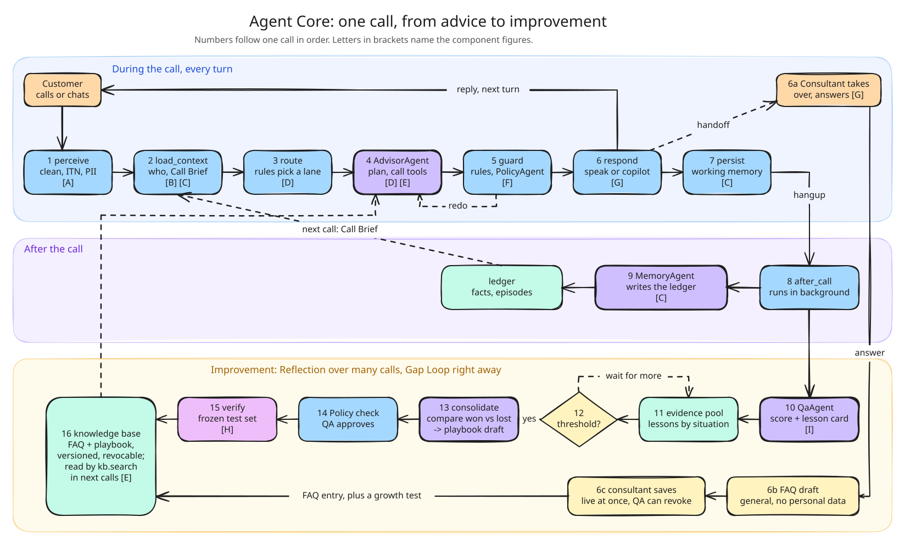
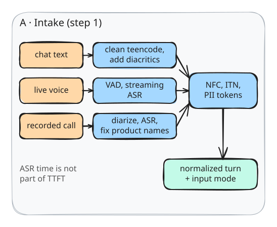
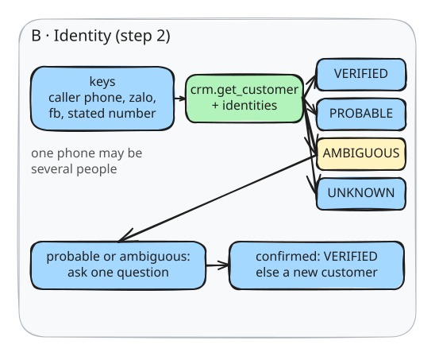
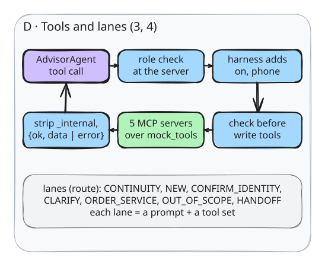
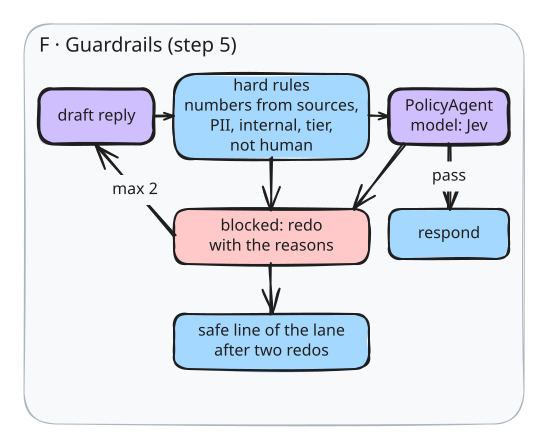
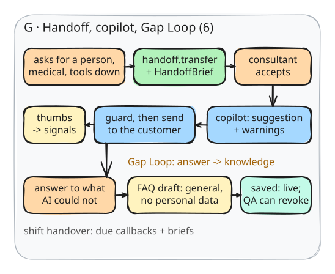
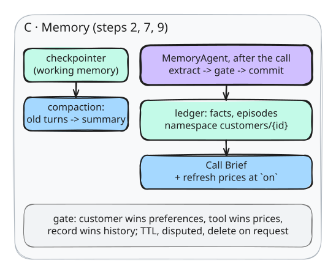
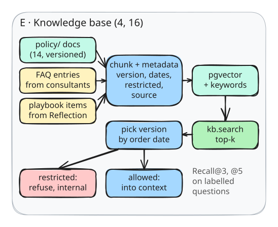
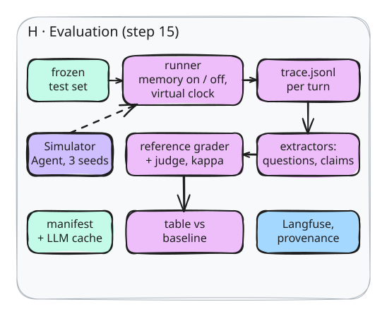
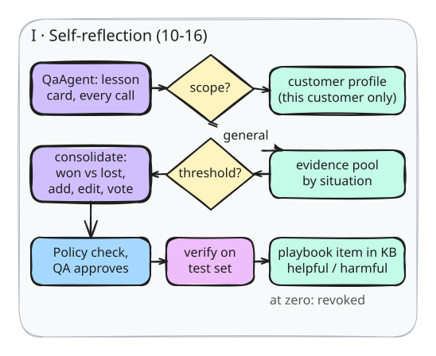

# Thiết kế Agent Core

[](../README.md)

Đây là **tài liệu thiết kế duy nhất** của dự án: chữ và hình nằm chung một chỗ. Hình vẽ bằng Excalidraw, tất cả trong một file nguồn [`figures/design.excalidraw`](figures/design.excalidraw) (mở và sửa trên [excalidraw.com](https://excalidraw.com) hoặc plugin Excalidraw của IDE). Mỗi hình trong tài liệu là một vùng cắt ra từ file đó, xuất thành SVG trong `figures/`. Sửa hình thì sửa file nguồn, xuất lại đúng các SVG bị ảnh hưởng, và sửa phần chữ đi kèm trong cùng một commit.

**Đọc hình.** Hình 1 kể một cuộc gọi, các bước đánh số theo thứ tự. Chữ trong ngoặc vuông ở một bước, ví dụ [C], trỏ tới hình component cùng tên (Hình A đến Hình I), đặt ở mục mô tả component đó. Màu: xanh dương là code của harness; tím viền đậm là agent (có gọi model); xanh lá là MCP server; xanh ngọc là nơi lưu state; cam là con người; vàng là cải tiến; hồng là đánh giá; đỏ nhạt là bị chặn. Nét đứt là dữ liệu đi sang một lượt hay một cuộc gọi sau. Nhãn trong hình bằng tiếng Anh.

Tài liệu này mô tả **thiết kế cuối**, đã gồm mọi hạng mục nâng cao của đề. Không có feature flag, không chia bản cơ bản với bản nâng cao: thứ gì có trong tài liệu là thứ được xây. Chỗ nào chưa quyết thì nằm ở Phụ lục E, không nằm rải trong các mục.

Nguồn ràng buộc, theo thứ tự ưu tiên: đề (`SUDO CODE 2026.pdf`); các điều chỉnh và giải đáp của ban tổ chức (`DIEU-CHINH-DE.md`, `GIAI-DAP-MENTOR.md`); gói dữ liệu và bộ chấm tham chiếu của ban tổ chức (Phụ lục A). Khi tài liệu này mâu thuẫn với chúng thì chúng thắng, và tài liệu này phải sửa.

---

## Bảy nguyên tắc

**1. Harness là sản phẩm.** Đề định nghĩa harness là toàn bộ phần bao quanh model: điều khiển vòng lặp, chọn ngữ cảnh đưa vào prompt, gọi tool, bắt lỗi, áp guardrail, ghi nhớ; và gọi đó là trọng tâm của đề (Đề, Phụ lục C.1). Model là bộ não; mọi thứ khiến hệ thống chạy đúng là code của harness.

**2. State chỉ nằm ở harness, agent không giữ state.** Working memory là state của graph nóng, lưu bằng checkpointer của chính graph đó. Profile và episodic nằm trong sổ cái. Mỗi agent chỉ là model, prompt, bộ tool và schema đầu vào: harness gọi nó với một lát cắt state, nó trả về một kết quả, và không giữ gì giữa hai lần gọi. Đây là cách các hệ production làm: agent là hàm của state (12-factor agents, yếu tố 12), state nằm ở session chứ không ở agent (Google ADK), agent con chạy trong ngữ cảnh sạch rồi trả kết quả (Anthropic, hệ nghiên cứu nhiều agent).

**3. Đơn giản trước.** Định tuyến bằng luật. Chỉ tách agent ở chỗ việc tách làm hệ thống tốt hơn và đo được. Mỗi cơ chế phải chỉ ra được yêu cầu nào của đề cần nó. Anthropic khuyên đúng như vậy: bắt đầu từ lời giải đơn giản nhất, chỉ thêm độ phức tạp khi đo được lợi ích (Building effective agents).

**4. Công tắc thay vì nhánh code.** Bộ nhớ đi vào lượt thoại qua đúng một chỗ, bước `retrieve` trong `load_context`. Tắt chỗ đó là có baseline: cùng graph, cùng prompt, cùng tool, cùng model. Đề bắt baseline chỉ được khác ở việc có nạp bộ nhớ hay không (Đề, Phụ lục A.6).

**5. Sự thật về khách nằm trong bộ nhớ, sự thật về doanh nghiệp nằm sau tool.** Giá, khuyến mãi, tồn kho, thời gian giao luôn lấy từ tool tại ngày của cuộc gọi. Bộ nhớ chỉ lưu sự kiện "đã báo giá X cho khách này vào ngày D"; đó là lịch sử, không bao giờ là giá hiện hành.

**6. Tất định thì là code, phán đoán mới là agent.** Chuẩn hóa, nhận diện, dựng brief, định tuyến, cắt ngữ cảnh, quét regex đều cho cùng kết quả mỗi lần nên là code. Model chỉ dùng ở chỗ cần hiểu nghĩa: soạn lời tư vấn, duyệt chính sách, quyết định ghi gì vào bộ nhớ, chấm cuộc gọi.

**7. Không có số thì không có gì.** Mọi con số tái lập bằng một lệnh. Con số chính thức là con số bộ chấm tham chiếu của ban tổ chức tính trên trace của hệ thống (Phụ lục A).

**Quy ước đặt tên.** Agent là danh từ có hậu tố `Agent`. Node của graph là động từ chữ thường. Tool dùng đúng tên có dấu chấm của ban tổ chức. Bảng dữ liệu viết snake_case.

**Các agent.** `AdvisorAgent` soạn lời trong lượt thoại. `PolicyAgent` duyệt câu nháp, dùng model Jev. `MemoryAgent` quyết định ghi gì sau cuộc gọi. `QaAgent` chấm cuộc gọi và viết bài học. `SimulatorAgent` chỉ sống trong bộ đánh giá. Vai "Orchestrator / Router" trong bảng C.3 của đề là node `route` của harness, viết bằng luật (mục 4.3).

---

## 1. Toàn cảnh



**Hình 1** đọc theo ba dải, từ trên xuống:

- **Trong cuộc gọi, mỗi lượt (1 đến 7).** Khách nói, lượt đi qua bảy node của harness, và câu trả lời vòng lên trên về lại khách cho lượt sau. Chỉ bước 4 là agent. `guard` chặn thì quay lại advisor (redo). Khi phải bàn giao, tư vấn viên nhận máy (6a).
- **Sau cuộc gọi (8, 9).** Cúp máy thì `after_call` chạy nền; `MemoryAgent` ghi sổ cái, và cuộc gọi sau đọc lại nó thành Call Brief.
- **Cải tiến, hai vòng.**
  - **Gap Loop, ngay lập tức (6a đến 6c):** câu tư vấn viên trả lời thay cho agent thành một mục FAQ, lưu vào kho tri thức.
  - **Reflection, qua nhiều cuộc (10 đến 16):** mỗi cuộc để lại một thẻ bài học; đủ ngưỡng thì đúc kết thành mục playbook, qua kiểm và duyệt rồi mới vào kho tri thức.

  Cả hai vòng cùng đổ vào kho tri thức (16), mà advisor tra bằng `kb.search` ở các cuộc sau.

Kể bằng kịch bản mẫu SAMPLE-01 của ban tổ chức.

**Ngày 15/10/2026, cuộc 1, hotline.** Chị Hoa hỏi máy lọc không khí cho phòng ngủ 25 m², nhà có bé nhỏ, ngân sách tầm 5 triệu. `perceive` chuẩn hóa câu, che số điện thoại thành token. `load_context` tra số gọi đến: chưa có hồ sơ, tier UNKNOWN, không có brief. `route` chọn lane NEW. `AdvisorAgent` gọi `catalog.search` rồi `pricing.get_quote(sku="SKU-AP-Y", on="2026-10-15")`: 5.200.000đ, khuyến mãi GIFT-FILTER tặng màng lọc tới 22/10. Chị nói để hỏi ông xã rồi gọi lại. `guard` xác nhận mọi con số trong câu trả lời đến từ tool; `respond` phát câu; `persist` lưu lượt thoại.

**Cúp máy.** Tác vụ `after_call` chạy nền. `MemoryAgent` tách và ghi: `room_area_m2=25`, `has_children=true`, `budget_vnd`, `product_advised=SKU-AP-Y`, `price_quoted_vnd=5200000`, `quoted_on=2026-10-15`, `promo_code=GIFT-FILTER`, `blocker="can hoi chong"`, cùng một dòng episodic. `QaAgent` chấm cuộc gọi theo rubric, gắn tình huống "chờ người nhà quyết", và viết một bài học lẻ.

**Ngày 17/10, cuộc 2, cùng số.** `load_context` khớp số, tier VERIFIED, dựng Call Brief, rồi hỏi lại tool tại ngày 17/10: giá vẫn 5.200.000đ, GIFT-FILTER còn hạn, còn hàng, nên không có cảnh báo. `route` chọn lane CONTINUITY. Advisor mở đầu bằng câu xác nhận tiếp nối, nhắc tối đa hai thông tin (sản phẩm và rào cản), không hỏi lại diện tích, ngân sách hay có con nhỏ. Chị đồng ý. Advisor chuẩn bị `order.create(sku="SKU-AP-Y", price_vnd=5200000, ...)`; harness kiểm tham số trước khi thực thi (giá đúng với báo giá tại ngày gọi, dưới trần COD) rồi mới cho chạy. Chốt đơn.

**Nếu khuyến mãi đã hết (SAMPLE-05).** `refresh` thấy khuyến mãi của báo giá cũ đã hết hạn, ghi một cảnh báo tươi mới. Advisor nói thẳng khuyến mãi đã hết và báo giá hiện hành, không giữ giá cũ.

**Nếu chị hỏi "đang cho con bú dùng được không".** Tài liệu không có thông tin y tế và quy định câu hỏi y tế phải chuyển máy. Advisor thừa nhận chưa có thông tin trước, rồi gọi `handoff.transfer` kèm Handoff Brief. Tư vấn viên nhận máy trên Agent Console và nói chuyện tiếp trong cùng phiên; mỗi câu họ gõ vẫn đi qua `guard`. Tư vấn viên trả lời xong thì Console đề nghị lưu câu trả lời thành FAQ; lưu là mục đó lên kho tri thức ngay, và khách sau hỏi câu tương tự thì advisor tự trả lời được (Gap Loop, mục 10.2).

**Ba nhịp, ba chu kỳ.** Lượt thoại (khách đang chờ), cuộc gọi (sau khi cúp máy, không ai chờ), cụm bằng chứng (cải tiến khi đủ nhiều cuộc giống nhau). Bộ đánh giá chạy đúng graph nóng này hai lần, bộ nhớ bật và tắt.

---

## 2. Kiến trúc triển khai

| Thành phần | Việc | Công nghệ |
|---|---|---|
| `postgres` | sổ cái, checkpointer của graph nóng, handoffs, signals, kho tri thức, improvement_log | Postgres 16 + pgvector |
| `api` | graph nóng, tác vụ `after_call`, SSE cho chat, WebSocket cho thoại | FastAPI + LangGraph |
| MCP server | `mcp-memory`, `mcp-catalog`, `mcp-crm`, `mcp-order`, `mcp-knowledge` (mục 6) | FastMCP |
| `ui` | trang khách, Agent Console và các trang cho nhân viên (mục 11) | React + Vite |
| thoại | VAD, ASR, TTS chạy local (mục 4.11) | Silero VAD, faster-whisper hoặc PhoWhisper, TTS tiếng Việt |
| Langfuse | màn hình soi trace, không phải nguồn sự thật | Cloud |

**Không có hàng đợi, không có worker riêng.** `after_call` là một tác vụ nền trong tiến trình api, chạy khi cúp máy. Nếu nó hỏng, cuộc gọi được đánh dấu chưa ghi nhớ và được chạy lại khi khởi động. Bộ đánh giá gọi thẳng hàm này, đồng bộ, giữa hai cuộc gọi.

**Một tiến trình.** api chạy với một worker; các phiên đồng thời là các task async. MCP server chạy stdio khi phát triển, streamable-http khi demo nhiều phiên. Đề yêu cầu ít nhất 2 phiên đồng thời ở chế độ nâng cao (Đề, C.2).

---

## 3. Trạng thái và quyền

### 3.1 `HotState`, chủ sở hữu duy nhất của working memory

Một `TypedDict`, lưu bằng checkpointer của graph nóng theo `thread_id = call_id`. Mỗi lượt thoại là một lần `invoke` trên cùng thread. Bảng `calls` chỉ là hình chiếu của state này cho giao diện, không phải nơi giữ state thứ hai.

| Trường | Nội dung | Ai ghi |
|---|---|---|
| `call_id`, `channel`, `now`, `on`, `switches` | định danh cuộc gọi, kênh, đồng hồ ảo, ngày của cuộc gọi, công tắc bộ nhớ | api khi bắt đầu, bộ đánh giá |
| `customer_id`, `tier`, `candidates`, `keys_seen` | kết quả nhận diện | `load_context` |
| `messages` | lịch sử lượt thoại, đã che PII | `perceive`, `respond` |
| `working_summary` | tóm tắt các lượt cũ khi hội thoại dài | advisor (hàm nén, mục 4.4) |
| `brief`, `freshness` | Call Brief và cảnh báo tươi mới | `load_context` |
| `lane` | cấu hình advisor cho lượt này | `route` |
| `tool_results`, `draft` | kết quả tool và câu nháp của lượt | `advisor` |
| `guard`, `regen_count`, `block_reasons` | kết quả kiểm | `guard` |
| `reply`, `latency` | câu đã phát và các mốc thời gian | `respond` |
| `mode`, `handoff` | nói trực tiếp hay copilot, bàn giao | `advisor` qua `handoff.transfer`, api khi nhân viên nhận máy |

Không agent nào có checkpointer riêng. Vòng ReAct bên trong advisor chỉ sống trong một lần gọi.

### 3.2 Lát cắt state cho từng agent

| Agent | Được nhận | Trả về |
|---|---|---|
| `AdvisorAgent` | `messages`, `working_summary`, các dòng brief, `freshness`, cấu hình lane, `tool_results`, `block_reasons`, `now` | `draft`, `tool_results` |
| `PolicyAgent` | `draft`, `tool_results`, đoạn chính sách liên quan. **Không** nhận brief, **không** nhận lịch sử | danh sách vi phạm kèm lý do |
| `MemoryAgent` | transcript đã che PII của cuộc gọi, fact hiện hành của khách đã xác nhận, `now` | quyết định ghi |
| `QaAgent` | transcript, nhật ký tool, rubric, danh mục tình huống | điểm, nhãn tình huống, bài học lẻ |

Policy nhận ít hơn Advisor là cố ý (mục 12).

### 3.3 Ai được ghi cái gì

| Tài nguyên | Ai ghi | Ai đọc |
|---|---|---|
| `HotState` + checkpointer | các node của graph nóng | graph nóng, bộ đánh giá |
| sổ cái (`facts`, `episodes`) | **chỉ `MemoryAgent`** | `load_context`, advisor qua tool đọc, QA, giao diện |
| `identities` | `load_context` ghi tạm; `MemoryAgent` xác nhận | `load_context` |
| đơn hàng, lịch gọi lại, bàn giao | advisor qua tool MCP | `load_context`, giao diện |
| kho tri thức (FAQ, playbook) | sau khi người duyệt | advisor qua `kb.search` |
| `signals`, `improvement_log` | mọi bên | trang Cải tiến |

### 3.4 Hai lớp thi hành

1. **Schema đầu vào của agent.** Policy không có trường `brief` trong input thì về mặt kỹ thuật không đọc được brief.
2. **Vai kiểm ở MCP server.** Mỗi client MCP mang một vai (`advisor`, `harness`, `memory_writer`, `admin`); server kiểm vai trước khi chạy tool, sai vai là từ chối. Tool ghi sổ cái không có trong danh sách tool của advisor, và nếu bằng cách nào đó được gọi thì server từ chối.

---

## 4. Harness: vòng mỗi lượt thoại

Đề vẽ vòng mỗi lượt là PERCEIVE → RESOLVE IDENTITY → RETRIEVE → PLAN → GUARDRAIL → ACT → OBSERVE → PERSIST (Đề, hình C.2). Graph nóng có bảy node, khớp một một với hình đó:

| Node | Hộp trong hình của đề |
|---|---|
| `perceive` | PERCEIVE |
| `load_context` | RESOLVE IDENTITY, RETRIEVE |
| `route` | chọn cách PLAN cho lượt này |
| `advisor` | PLAN, GUARDRAIL trước tool ghi, ACT, OBSERVE |
| `guard` | GUARDRAIL trên câu trả lời |
| `respond` | ACT (trả lời) |
| `persist` | PERSIST |

Cạnh: `START → perceive → load_context → route → advisor → guard`; `guard` chặn và còn lượt sinh lại thì quay về `advisor`, qua thì sang `respond → persist → END`. `load_context` chỉ làm việc ở lượt đầu cuộc gọi hoặc khi lượt thoại mang một khóa danh tính mới; các lượt khác nó đi thẳng qua.

### 4.1 `perceive`

Nhận một lượt của khách (câu chat, hoặc text từ ASR) cùng chế độ đầu vào (`clean`, `asr_transcript`, `chat_teencode`). Code thuần, dưới 50 ms:

- **Làm sạch text:** teencode, viết tắt, không dấu, pha Việt Anh ("sp nay co ship cod k a").
- **Chuẩn hóa dấu:** đưa về NFC trước mọi so khớp.
- **ITN:** chuyển dạng nói sang dạng viết cho tiền, số điện thoại, ngày giờ. "bốn triệu tám" là 4.800.000; "hai trăm bốn chín k" là 249.000; "thứ tư tuần sau" quy ra ngày theo `now`. ITN có bộ test riêng, vì đề coi Entity Accuracy của tiền và số điện thoại quan trọng hơn WER (Đề, Phụ lục A.5).
- **Che PII:** số điện thoại, CCCD, số tài khoản, địa chỉ thành token `<PHONE_1>`, `<ADDR_1>`, lưu trong `pii_vault` kèm `customer_id`. Model không bao giờ thấy PII thô. CCCD và số tài khoản chỉ đi vào biểu mẫu nghiệp vụ, không vào bộ nhớ, và log chỉ giữ 4 số cuối (chính sách QT-04, PB-08).
- **Cờ:** `asr_low_conf` khi đoạn ASR có độ tin cậy thấp, hoặc ITN không đọc ra được con số cần đọc.



**Hình A.** Ba nguồn vào: chat, thoại trực tiếp, file ghi âm. Mỗi nguồn có bước làm sạch riêng, rồi cùng đi qua một bộ chuẩn hóa (NFC, ITN, token PII) và ra một lượt thoại đã chuẩn hóa kèm chế độ đầu vào. Kênh thoại chi tiết ở mục 4.11.

### 4.2 `load_context`

Gộp ba bước RESOLVE và RETRIEVE, chạy các lời gọi tool song song.

**Nhận diện (`resolve`).** Khóa lấy từ siêu dữ liệu kết nối (số gọi đến, định danh kênh Zalo hoặc Facebook) và từ nội dung (số điện thoại hay mã đơn khách tự nói). Tra `crm.get_customer` và bảng `identities` (khóa băm HMAC). Một khóa có thể trỏ tới nhiều khách, vì số điện thoại là khóa của một hộ, không phải của một người.

| Tier | Điều kiện | Được làm gì |
|---|---|---|
| VERIFIED | khóa khớp đúng một khách, hoặc đã được xác nhận trong cuộc | nạp brief đầy đủ |
| PROBABLE | khóa do khách tự khai giữa cuộc, chưa xác nhận | lane CONFIRM_IDENTITY: một câu xác nhận, không đọc giá, địa chỉ, mã đơn |
| AMBIGUOUS | khóa khớp từ hai khách trở lên | không nạp brief của ai; lane CONFIRM_IDENTITY |
| UNKNOWN | không khớp | khách mới, lane NEW |

**Số dùng chung và brief không khớp.** Khi AMBIGUOUS, harness gỡ bằng tín hiệu có sẵn trước khi phải hỏi: định danh kênh chỉ thuộc một người, cách khách tự xưng, chủ đề khớp phiên cũ. Còn mơ hồ thì advisor hỏi đúng một câu, và hỏi sao cho không lộ hồ sơ của người kia ("Dạ cho em xin tên của mình để em xem đúng thông tin ạ?"). Trả lời khớp một người thì chuyển VERIFIED và nạp brief của người đó; không khớp ai thì tạo khách mới trên cùng khóa. Cùng cơ chế áp cho ca VERIFIED nhưng lời khách không khớp brief (xưng tên khác, hỏi ngành hàng khác): hỏi xác nhận một câu trước khi tiếp tục (playbook PB-01).

**Khách gọi từ số lạ.** Khách nói "hôm trước bên em tư vấn chị máy lọc", advisor xin số cũ, khách đọc số, khóa mới được ghi tạm, tier PROBABLE, advisor hỏi một câu xác nhận về thứ đã tư vấn, khách xác nhận thì lên VERIFIED trong cuộc đó. `MemoryAgent` xác nhận liên kết sau cuộc gọi.



**Hình B.** Khóa từ kết nối và từ lời khách → tra `crm.get_customer` và bảng `identities` → một trong bốn tier. PROBABLE hoặc AMBIGUOUS thì hỏi đúng một câu; xác nhận được thì VERIFIED, không thì là khách mới.

**Đọc bộ nhớ (`retrieve`), công tắc bộ nhớ.** Tắt thì trả về không có gì: đó là baseline. Bật thì đọc sổ cái của khách đã xác nhận qua `mcp-memory` (vai `harness`) và dựng Call Brief bằng một hàm thuần theo template, không để model viết tự do. Brief là một object đúng schema `CallBrief` (Phụ lục A), kèm các dòng đánh số `B1..Bn`, mỗi dòng mang `fact_ids` để truy vết. Tóm tắt episodic được tính sẵn ở cuối cuộc trước và khai báo trong `precomputed_parts`.

**Kiểm tươi mới (`refresh`).** Hỏi lại tool tại ngày `on` của cuộc gọi: báo giá của mỗi sản phẩm đã tư vấn (`pricing.get_quote`), tồn kho (`inventory.check`), trạng thái đơn (`order.status`), và tương tác ở kênh khác sau phiên trước. Chỗ nào lệch thì ghi một dòng vào `stale_warnings`, ví dụ "GIFT-FILTER đã hết hạn 22/10, giá hiện tại 5.200.000đ không kèm quà". Dòng cảnh báo không bao giờ bị cắt khỏi ngữ cảnh.

**Độ trễ Call Brief** tính từ sự kiện nhận diện tới khi object `CallBrief` sẵn sàng, gồm cả `refresh`, và phải dưới 3 giây (Đề, C.2; `huong-dan-do-latency.md`).

### 4.3 `route`: vai Orchestrator / Router, bằng luật

Chọn **lane** cho lượt này. Lane là một cấu hình của `AdvisorAgent`: một đoạn chỉ dẫn cộng một bộ tool, khai báo trong `config/lanes.yaml`. Luật chỉ đọc những gì đã có trong state, không gọi model, cho cùng kết quả mỗi lần.

| Thứ tự | Điều kiện | Lane | Tool của advisor |
|---|---|---|---|
| 1 | tool hỏng liên tiếp, hoặc `guard` đã phải dùng câu an toàn hai lần trong cuộc | HANDOFF | `handoff.transfer` |
| 2 | `asr_low_conf` | CLARIFY | không |
| 3 | tier PROBABLE hoặc AMBIGUOUS, hoặc brief không khớp lời khách | CONFIRM_IDENTITY | không |
| 4 | khách có đơn và lượt thoại nói về đơn, đổi size, đổi địa chỉ, trạng thái giao | ORDER_SERVICE | `order.status`, `order.update`, `crm.get_customer`, `handoff.transfer` |
| 5 | câu hỏi thông tin mà `kb.search` không có đoạn nào vượt ngưỡng | OUT_OF_SCOPE | `handoff.transfer` |
| 6 | VERIFIED và có brief | CONTINUITY | `catalog.search`, `inventory.check`, `pricing.get_quote`, `order.create`, `schedule.callback`, `kb.search`, `handoff.transfer` |
| 7 | còn lại | NEW | như CONTINUITY |

**Ngoài phạm vi.** Lane OUT_OF_SCOPE bắt advisor thừa nhận chưa có thông tin trước. Nó chỉ gọi `handoff.transfer` khi khách muốn gặp người hoặc chủ đề thuộc loại bắt buộc chuyển (câu hỏi y tế, PB-06). Các câu còn lại dừng ở lời thừa nhận, không gọi tool nào, đúng như cách đề chấm ca khó "hỏi ngoài tài liệu" (Đề, Phụ lục A.3).

**Vì sao không dùng model định tuyến, cũng không dùng một agent quản lý.** Mỗi lượt thêm một lời gọi model thì ngân sách TTFT 3 giây không còn chỗ. Anthropic ghi nhận agent chưa giỏi phối hợp và giao việc cho nhau theo thời gian thực, và hệ nhiều agent tốn khoảng 15 lần token so với chat; một cuộc gọi bán hàng lại đúng là việc cần chung ngữ cảnh và phản hồi ngay. Đề cũng không bắt buộc nhiều agent: mục C.3 cho chọn MCP hoặc A2A, chọn ít nhất một. Nếu đo được luật định tuyến sai ở những ca có thật, sẽ thêm một model định tuyến sau luật (Phụ lục E).

### 4.4 `advisor`: `AdvisorAgent`

Vòng ReAct của LangGraph: node model gọi tool của lane, node tool thực thi, lặp tới khi model trả câu không kèm tool call, tối đa ba vòng tool mỗi lượt. Model dựng bằng `init_chat_model` từ cấu hình; tool lấy từ MCP với vai `advisor`. Agent không giữ state: harness đưa ngữ cảnh vào mỗi lượt.

**Dựng ngữ cảnh.** Một hàm thuần xếp ngữ cảnh theo thứ tự cố định, và khi vượt hạn mức token thì cắt từ dưới lên:

1. quy tắc cứng và giọng điệu;
2. `stale_warnings` (không bao giờ bị cắt);
3. chỉ dẫn của lane;
4. các dòng brief;
5. `working_summary` và bốn lượt gần nhất;
6. đoạn tri thức từ `kb.search` (chỉ bản chính sách đang hiệu lực, không bao giờ đoạn nội bộ);
7. mục playbook đang dùng.

Khi hội thoại dài quá ngưỡng, một lời gọi model nhỏ tóm các lượt cũ vào `working_summary`, giữ bốn lượt cuối. Đề yêu cầu trình bày được "đưa gì vào prompt và cắt gì" và nén ngữ cảnh khi vượt cửa sổ (Đề, C.2).

**Chính sách gọi tool.**

| Loại thông tin | Nguồn |
|---|---|
| giá, khuyến mãi, tồn kho, thời gian giao, trạng thái đơn | luôn gọi tool trong lượt này |
| chính sách đổi trả, vận chuyển, bảo hành | `kb.search` |
| thứ đã có trong brief và còn tươi | dùng brief |
| xã giao, câu hỏi làm rõ | không gọi |

**Harness bổ sung và lọc tham số.** Harness tự chèn `on` và `customer_phone` vào tham số tool, nên model không cần thấy số điện thoại thật. Harness cũng xóa mọi trường nội bộ (tên bắt đầu bằng `_internal`) khỏi kết quả trước khi model thấy.

**Kiểm trước tool ghi (GUARDRAIL trước ACT).** Trước khi thực thi một tool có tác dụng, harness kiểm tham số; sai thì trả về cho model như một lỗi tool, kèm lý do:
- `order.create`: `price_vnd` bằng giá của `pricing.get_quote` tại ngày gọi; tổng đơn COD không quá 10.000.000đ; tier VERIFIED; đủ tham số bắt buộc.
- `order.update`: đơn thuộc khách đang nói; thao tác hợp lệ theo chính sách đổi trả.
- `handoff.transfer`: brief hợp lệ theo schema `HandoffBrief`. Harness điền sẵn các trường lấy được từ state (số điện thoại, tên, sản phẩm, giá, thời điểm); model điền tóm tắt, lý do, câu chưa trả lời được, việc cần làm.
- `schedule.callback`: thời điểm hẹn nếu rơi vào giờ nghỉ hoặc ngày nghỉ sẽ bị tool dời đi, và advisor phải báo khách thời điểm mới.

**Đầu ra.** Câu trả lời dạng văn bản, có đánh dấu dòng brief đã dùng (`[B3]`). Harness bóc các dấu này trước khi phát và dùng chúng để truy vết.

**Quy tắc trung thực.** Không bao giờ nhận là người thật. Không biết thì nói không biết trước. Tier chưa VERIFIED thì không đọc giá đã báo, địa chỉ, mã đơn.



**Hình D.** Một lời gọi tool của advisor: server kiểm vai → harness chèn `on` và số điện thoại → kiểm tham số nếu là tool ghi → năm MCP server trên mock của ban tổ chức → harness lọc trường nội bộ và trả về dạng `{ok, data | error}`. Khung dưới là các lane của `route` (mục 4.3): mỗi lane là một prompt cộng một bộ tool.

### 4.5 `guard`

Kiểm câu nháp trước khi khách thấy. Cứng trước, mềm sau: cứng thì rẻ, tất định và chặn được phần lớn lỗi.

**Kiểm cứng, code thuần.**

| Kiểm tra | Cách làm |
|---|---|
| con số | mọi số tiền trong câu phải đến từ một nguồn hợp lệ: kết quả tool của lượt, đoạn chính sách vừa tra, lời chính khách nói, hoặc phép nhân số lượng với đơn giá. Giá trong brief chỉ được nói như lịch sử ("hôm trước bên em báo") |
| thông tin nội bộ | không có giá nhập, biên lợi nhuận hay tên nhà cung cấp của tài liệu nội bộ |
| PII | không có PII thô, không có thông tin của khách khác |
| tier | tier chưa VERIFIED thì không lộ giá đã báo, địa chỉ, mã đơn |
| nhận là người | chặn mẫu câu nhận là người thật |
| định dạng | rỗng, quá dài (quá 3 câu, trừ khi tổng kết đơn), không phải tiếng Việt, còn token PII |

**Kiểm mềm, `PolicyAgent` với model Jev.** Đối chiếu câu nháp với đoạn chính sách liên quan để bắt thứ regex không bắt được: hứa ngoài chính sách, dùng chính sách đã hết hiệu lực, bình luận giá đối thủ, tạo áp lực giả khi tồn kho không xác nhận. Policy chỉ thấy câu nháp, kết quả tool và đoạn chính sách.

**Khi chặn.** Câu nháp quay về advisor kèm lý do, tối đa hai lần sinh lại; hết lượt thì phát câu an toàn của lane ("Dạ để em kiểm tra kỹ rồi phản hồi chị ngay ạ") và ghi log. Hai câu an toàn trong một cuộc thì lượt sau `route` chọn HANDOFF.



**Hình F.** Luật cứng trước, `PolicyAgent` (Jev) sau. Bị chặn ở bất kỳ bước nào thì câu nháp quay lại kèm lý do, tối đa hai lần, rồi phát câu an toàn.

### 4.6 `respond`

**Nói trực tiếp:** phát câu cho khách, qua SSE với chat, qua TTS với thoại.

**Copilot** (sau khi tư vấn viên nhận máy): câu của advisor thành gợi ý cho tư vấn viên, kèm cảnh báo nếu `guard` phát hiện vi phạm. Tư vấn viên dùng nguyên, sửa, hoặc tự viết; câu cuối cùng họ gửi cũng đi qua `guard`, có vi phạm thì hiện cảnh báo trước khi gửi. Lựa chọn của họ ghi thành tín hiệu 👍 hoặc 👎. Ở chế độ copilot, `order.create` phải được tư vấn viên duyệt.

### 4.7 `persist`

Mỗi lượt: checkpointer của graph lưu working memory; transcript (đã che PII) thêm một lượt; bộ đánh giá ghi một dòng trace. Khi cúp máy: tác vụ `after_call` chạy `MemoryAgent` (mục 5.4) và `QaAgent` (mục 9.7, 10.3). Đề đặt PERSIST trong vòng mỗi lượt; ban tổ chức cũng khuyến khích ghi theo từng lượt và chỉ yêu cầu trình bày được ghi gì, lúc nào (`GIAI-DAP-MENTOR.md`, Team 5, câu 3).

### 4.8 Độ trễ và streaming

**Định nghĩa của ban tổ chức** (`huong-dan-do-latency.md`):

| Chỉ số | Bắt đầu | Kết thúc | Ngưỡng p95 |
|---|---|---|---|
| TTFT | request lượt chat tới API | token đầu tiên **của câu trả lời** | 3 s |
| Total | như trên | token cuối cùng | 8 s |
| TTFA | khách dừng nói (VAD) | byte audio đầu tiên được phát | 2,5 s |
| Call Brief | sự kiện nhận diện | object `CallBrief` sẵn sàng | 3 s |

Đo tại ranh giới backend bằng đồng hồ đơn điệu, đơn vị mili giây, số nguyên. Câu đệm không phải token của câu trả lời. Bỏ ba lượt khởi động. p95 tính đúng bằng hàm của bộ chấm tham chiếu. Thời gian ASR của file ghi âm offline không tính vào TTFT.

**Ngân sách mỗi lượt:** `perceive` dưới 50 ms; `load_context` chỉ chạy ở lượt đầu, song song, dưới 3 s; `route` dưới 10 ms; advisor một đến hai lời gọi model; kiểm cứng dưới 50 ms; PolicyAgent qua Jev, trung vị đo được khoảng 0,6 s.

**Streaming chưa quyết** (Phụ lục E). Không stream thì TTFT bằng Total, nên cả lượt phải xong trong 3 s ở p95. Stream thì lại xung đột với việc `guard` cần câu hoàn chỉnh. Câu đệm ("Dạ chị chờ em một xíu, em kiểm tra ngay ạ") chỉ phát khi advisor bắt đầu gọi tool, và không được tính là TTFT.

### 4.9 Fallback

| Sự cố | Phát hiện | Hệ thống nói gì | Hệ thống làm gì |
|---|---|---|---|
| tool lỗi hoặc timeout | adapter trả `{ok: false, retryable}` | "Dạ hệ thống bên em đang tra cứu hơi chậm, em xin phép nhắn lại chị trong ít phút ạ" | thử lại một lần, **không đoán số**, đề nghị hẹn gọi lại; lỗi liên tiếp thì lane HANDOFF |
| MCP server chết | kiểm sức khỏe của adapter | như tool lỗi | ngắt mạch tool đó trong 60 giây |
| ASR trả rác | `asr_low_conf` | "Dạ em nghe chưa rõ, chị đọc lại giúp em số điện thoại ạ" | lane CLARIFY, hỏi một câu ngắn |
| model trả sai định dạng | parse thất bại | thử lại một lần; lần nữa thì câu an toàn | ghi log |
| không có bộ nhớ | VERIFIED nhưng sổ cái trống | nói chuyện như khách mới, **không giả vờ nhớ** | lane NEW |
| bộ nhớ mâu thuẫn | fact `disputed` trong brief | "Dạ để em xác nhận lại, hôm trước bên em báo chị 5.200.000đ đúng không ạ?" | câu xác nhận, không tự chọn bên |
| ngoài phạm vi | lane OUT_OF_SCOPE | "Dạ phần này em chưa có thông tin chính xác", rồi đề nghị kết nối người nếu cần | `handoff.transfer` nếu khách đồng ý hoặc chủ đề bắt buộc |
| `guard` chặn hết lượt | `regen_count = 2` | câu an toàn của lane | ghi log; hai lần trong cuộc thì HANDOFF |

Thừa nhận trước, rồi mới chuyển. Bịa rồi mới chuyển là trượt Task Success và cộng thêm vào Hallucination Rate.

### 4.10 Bàn giao

**Nguyên nhân:** khách muốn gặp người; câu hỏi thuộc loại bắt buộc chuyển; tool hỏng không tự phục hồi; `guard` phải dùng câu an toàn hai lần; bàn giao giữa ca.

**Cơ chế.** Advisor gọi `handoff.transfer(brief)`, với brief đúng schema `HandoffBrief`. Harness ghi một dòng `handoffs` trạng thái chờ, phát câu nối một lần ("Dạ em kết nối chị với đồng nghiệp phụ trách ngay ạ"), rồi chuyển phiên sang copilot. Agent Console hiện thẻ bàn giao; tư vấn viên bấm nhận và nói chuyện tiếp trong cùng phiên (mục 4.6). Khi cúp máy, `after_call` chạy trên toàn bộ transcript, lượt của người được đánh dấu `speaker=human_agent`.

**Nội dung Handoff Brief:** khách là ai, sản phẩm đã tư vấn và giá, rào cản, cam kết đã hứa, fact đang tranh chấp, lý do chuyển, câu khách hỏi mà hệ thống chưa trả lời được, trạng thái đơn, việc người nhận nên làm ngay. Viết để người đọc hiểu trong mười giây, không phải hỏi lại khách.

**Bàn giao giữa ca** là một trang: mọi lịch gọi lại đến hạn trong ca tới, mỗi dòng kèm brief dựng tại chỗ, cộng các bàn giao chưa đóng. Brief là hàm của sổ cái, không phải trí nhớ của người, nên nhân viên nghỉ việc cũng không mất gì.



**Hình G.** Hàng trên: lý do chuyển → `handoff.transfer` kèm brief → tư vấn viên nhận máy. Hàng giữa: copilot đưa gợi ý kèm cảnh báo, câu tư vấn viên gửi đi qua `guard`, lựa chọn của họ thành tín hiệu. Hàng dưới là Gap Loop (mục 10.2): câu trả lời cho điều agent không trả lời được thành bản nháp FAQ, lưu là lên kho tri thức ngay.

### 4.11 Kênh thoại

**Cuộc gọi trực tiếp:** VAD phát hiện khách dừng nói, ASR local chạy theo luồng, text đi vào đúng vòng lặp ở trên, câu trả lời đi ra TTS. **Khách ngắt lời:** VAD phát hiện khách nói khi TTS đang phát thì dừng phát ngay, và working memory chỉ ghi phần câu đã thực sự nói ra. TTFA đo từ lúc khách dừng nói tới byte audio đầu tiên; để đạt 2,5 s, TTS phải nhận câu trả lời theo từng câu, nên kênh thoại phụ thuộc quyết định streaming (Phụ lục E).

**File ghi âm offline:** tách người nói (pyannote), ASR, sửa lỗi bằng từ điển tên sản phẩm ("Xiao Mi" thành Xiaomi, "sai z eo" thành size L), xử lý audio nhiễu, rồi nạp từng lượt vào vòng lặp như một phiên chat. Một cuộc gọi ghi âm và một phiên chat đi qua đúng một harness.

---

## 5. Bộ nhớ



**Hình C.** Trái là bộ nhớ ngắn hạn: checkpointer của graph nóng và bước nén các lượt cũ. Phải là bộ nhớ dài hạn: `MemoryAgent` ghi sau cuộc gọi (trích xuất, lọc, ghi) vào sổ cái theo từng khách, và `load_context` đọc lại thành Call Brief rồi kiểm giá tại ngày gọi. Khung dưới là luật của cổng ghi.

### 5.1 Các tầng

| Tầng | Nơi lưu |
|---|---|
| Working | `HotState`, checkpointer của graph nóng |
| Episodic | bảng `episodes`: mỗi cuộc gọi một dòng tóm tắt |
| Profile | bảng `facts`: sự thật bền vững về khách |
| Tri thức | kho tri thức: chính sách, FAQ, playbook (mục 7) |

### 5.2 Ontology

Tên slot dùng **đúng** tên của ban tổ chức, dạng phẳng, vì bộ chấm so khớp chuỗi chính xác: `product_advised`, `variant_sku`, `size`, `color`, `price_quoted_vnd`, `quoted_on`, `promo_code`, `promo_expiry`, `budget_vnd`, `blocker`, `decision_maker`, `callback_at`, `outcome`, `order_id`, `payment`, `address_token`, `competitor_price_vnd`, `objection_type`, `objection_handling`, `sentiment`, `commitments`. Thuộc tính nhu cầu theo ngành nằm trong một file schema cho mỗi ngành, cũng dạng phẳng: `room_area_m2`, `has_children` cho gia dụng; kích cỡ chân, mục đích dùng cho thời trang; tuổi của bé cho mẹ và bé. Thêm ngành hàng là thêm một file schema.

**Ghi chú mở** cho sự thật bền không thuộc slot nào (mua cho mẹ bị tiểu đường). Có trần cứng theo khách; không bao giờ là căn cứ cho một khẳng định về giá hay chính sách.

### 5.3 Bảng dữ liệu

| Bảng | Cột chính |
|---|---|
| `facts` | `fact_id`, `customer_id`, `slot`, `value`, `kind` (sở thích, sự kiện kinh doanh, sự kiện đã xảy ra, ghi chú mở), `status` (active, invalidated, disputed), `valid_from`, `valid_to`, `confidence`, `source{call_id, turn, channel, extractor_version}`, `superseded_by` |
| `episodes` | `episode_id`, `customer_id`, `call_id`, `channel`, `started_at`, `summary`, `outcome`, `objection_type`, `sentiment`, `commitments`, `source_turn_span` |
| `identities` | `key_type`, `key_hash`, `customer_id`, `status` (tạm, đã xác nhận). Một khóa có thể trỏ tới nhiều khách |
| `pii_vault` | token, giá trị đã mã hóa, `customer_id` |

Sổ cái không xóa, không ghi đè: khách đổi ý thì dòng cũ đóng hiệu lực, dòng mới mở ra. Khung nhìn `current_facts` chỉ trả dòng `active` còn hiệu lực theo đồng hồ ảo `now`, nên không bao giờ có hai giá trị mâu thuẫn cùng sống.

**Thời hạn theo slot:** báo giá hết theo hạn khuyến mãi; rào cản và ý định mua hết sau 30 ngày; địa chỉ sau 180 ngày thì hỏi lại là hợp lý; thuộc tính nhu cầu không hết hạn. Slot hết hạn không còn trong brief, và câu hỏi lại về nó không bị tính là thừa (Đề, Phụ lục A.1).

### 5.4 Cổng ghi: `MemoryAgent`

Chạy trong `after_call`, với vai `memory_writer`: là **đường duy nhất được ghi sổ cái**.

1. **`load`:** transcript đã che PII của cuộc gọi, fact hiện hành, `now`.
2. **`extract`:** một lời gọi model có structured output, nhận ontology của ngành: danh sách ứng viên `{slot hoặc ghi chú, value, kind, turn, confidence}`, cộng loại phản đối, cách xử lý, sentiment, cam kết.
3. **`gate`:** bỏ nhiễu và câu xã giao; chặn vùng ghi chú mở khi đã đầy; kiểm kiểu và khoảng hợp lý (ngân sách không phải 5 đồng, diện tích không phải 2.500 m²); rồi áp luật thắng theo loại slot:

| Loại slot | Ai thắng |
|---|---|
| sở thích, nhu cầu | khách thắng, lời mới thắng lời cũ ("thôi anh lấy màu trắng") |
| sự kiện kinh doanh | tool thắng; lời khách nói ngược chỉ lưu như một phát ngôn, fact bị đánh dấu `disputed` |
| sự kiện đã xảy ra | bản ghi hệ thống thắng |

4. **`commit`:** với slot đóng, thêm, cập nhật hay vô hiệu hóa là quyết định bằng code theo bảng trên; chỉ ghi chú mở mới cần model nhỏ để biết trùng hay bổ sung. Khóa chống ghi trùng là `call_id`, `turn`, `slot`, `extractor_version`.
5. **`summarize`:** một dòng episodic, ví dụ "Cuộc 1 (15/10, hotline): tư vấn SKU-AP-Y 5.200.000đ kèm GIFT-FILTER, khách chờ hỏi chồng".

**Chống đầu độc bộ nhớ.** Chỉ ghi vào `customer_id` đã được xác nhận trong cuộc. Hết cuộc mà danh tính vẫn chưa xác nhận thì không ghi vào hồ sơ nào đang có. Một fact bị hai nguồn độc lập phủ nhận thì chuyển `disputed`, và có thể thu hồi cả cụm fact cùng một nguồn.

**Xóa theo yêu cầu** (chính sách QT-06): advisor xác nhận lại bằng một câu; hệ thống xóa profile, episodic và dòng vault của khách, giữ đơn hàng đã ẩn danh; lần sau khách gọi là khách mới.

### 5.5 Truy vết nguồn gốc

| Từ | Về | Bằng |
|---|---|---|
| câu agent nói | dòng brief đã dùng | dấu `[Bn]` |
| dòng brief | fact | `fact_ids` |
| fact | lượt thoại | `source{call_id, turn}` |
| lượt thoại | audio, giá trị PII | `audio_ref`, token trong vault |
| câu agent nói | tool đã gọi, kết quả kiểm | tham số và kết quả tool, kết quả `guard` |
| mục FAQ | câu trả lời của tư vấn viên | `call_id`, `turn` |
| mục playbook | các bài học làm bằng chứng | `lesson_ids` |

Từ một câu "hôm trước bên em báo chị 5.200.000đ" truy ngược được về dòng brief, fact báo giá, cuộc 1 lượt 3, transcript và file ghi âm.

---

## 6. MCP: server, tool và phân quyền

### 6.1 Server và tool

Tên tool và tham số bắt buộc theo đúng schema của ban tổ chức, vì bộ chấm đối chiếu tham số tool (`DIEU-CHINH-DE.md`, mục 3).

| Server | Tool | Tham số chính |
|---|---|---|
| `mcp-memory` | `memory.get_profile`, `memory.get_episodes`, `memory.get_open_items`, `identity.find` | `customer_id`, khóa băm |
| | `identity.link_provisional` (vai `harness`) | `customer_id`, khóa |
| | `memory.commit_facts`, `memory.commit_episode`, `memory.confirm_identity` (vai `memory_writer`) | quyết định ghi |
| | `memory.delete_customer` (vai `admin`) | `customer_id` |
| `mcp-catalog` | `catalog.search` | `query`, `category`, `sku`, `max_price_vnd`, `min_room_area_m2` |
| | `inventory.check` | `sku`, `on` |
| | `pricing.get_quote` | `sku`, `on`, `qty`, `customer_phone`, `address`, `basket_skus` |
| `mcp-crm` | `crm.get_customer` | `phone` hoặc `zalo_id` hoặc `fb_id` |
| | `order.create` | `customer_phone`, `sku`, `qty`, `price_vnd`, `promo_code`, `payment`, `address` |
| | `schedule.callback` | `customer_phone`, `callback_at`, `note` |
| | `handoff.transfer` | `brief` |
| `mcp-order` | `order.status` | `order_id` hoặc `customer_phone` |
| | `order.update` | `order_id`, `action`, `new_variant_sku`, `reason` |
| `mcp-knowledge` | `kb.search` | `query`, `k`, `on` |
| | `kb.upsert` (vai `admin`, sau khi duyệt) | đoạn tri thức |

**Logic nghiệp vụ là mock tham chiếu của ban tổ chức.** Các tool catalog, CRM và đơn hàng bọc `eval/mock_tools.py`, nên kết quả trùng với bộ chấm ngay từ cách dựng: giá sau khuyến mãi theo điều kiện, tồn kho theo ngày, trần COD, dời lịch ngày nghỉ, số dùng chung. Mock có state trong tiến trình; bộ đánh giá reset nó theo từng kịch bản và từng cấu hình. Đề cho phép mock với schema rõ ràng, không cần hệ thống thật (Đề, C.2).

**Hợp đồng lỗi chung:** mọi tool trả `{ok, data | error{code, retryable, message}}`. Timeout 2 giây cho catalog và CRM, 3 giây cho tri thức; thử lại một lần khi `retryable`.

### 6.2 Vai

| Vai | Ai cầm | Được gọi |
|---|---|---|
| `advisor` | `AdvisorAgent` | tool nghiệp vụ của lane, `memory.get_*`, `kb.search` |
| `harness` | `load_context` | `memory.get_*`, `identity.*`, `crm.get_customer`, `pricing.get_quote`, `inventory.check`, `order.status` |
| `memory_writer` | `MemoryAgent` | `memory.commit_*`, `memory.confirm_identity` |
| `admin` | duyệt tri thức, xóa dữ liệu | `kb.upsert`, `memory.delete_customer` |

Đề yêu cầu "phân quyền theo tool: tool nào được ghi dữ liệu" (Đề, C.3). Vai được gắn ở client và kiểm ở server; không có đường vòng.

### 6.3 Vì sao MCP, và agent để làm gì

Đề cho chọn MCP hoặc A2A/multi-agent, ít nhất một (Đề, C.3). **MCP là câu trả lời chính:** bộ nhớ và nghiệp vụ nằm sau ranh giới server nên baseline là một cấu hình chứ không phải nhánh code, và phân quyền là thứ server kiểm chứ không phải lời hứa trong prompt.

Hệ thống vẫn có nhiều agent, nhưng chỉ ở chỗ việc tách làm nó tốt hơn (mục 12), và điều đó được chứng minh bằng ablation có số liệu. Không dùng giao thức A2A: A2A giả định các agent là hộp đen không chia sẻ state, trong khi ở đây mọi agent đọc cùng một state do harness nắm giữ.

---

## 7. Kho tri thức và RAG



**Hình E.** Ba nguồn đổ vào cùng một kho: tài liệu chính sách, mục FAQ do tư vấn viên lưu, mục playbook đã duyệt. Mỗi đoạn mang metadata, được đánh chỉ mục, tra bằng `kb.search`, chọn đúng phiên bản; đoạn nội bộ thì từ chối, đoạn được phép thì vào ngữ cảnh.

**Kho.** Ba nguồn, mỗi nguồn một loại mã:
- **Tài liệu chính sách:** thư mục `policy/` của ban tổ chức, 14 tài liệu, mỗi mục `## [XX-nn]` là một đoạn.
- **Mục FAQ:** câu trả lời của tư vấn viên sau bàn giao, đã viết lại thành câu chung (Gap Loop, mục 10.2).
- **Mục playbook:** cách xử lý một tình huống, đúc kết từ nhiều cuộc gọi và đã được duyệt (Reflection, mục 10.3).

Advisor chỉ biết thêm điều mới qua kho này; đó là lý do cả hai vòng cải tiến đều ghi vào đây.

**Siêu dữ liệu mỗi đoạn:** tài liệu, phiên bản, ngày bắt đầu và ngày hết hiệu lực (lấy từ `changelog.md`), cờ `restricted`, ngành hàng.

**Truy hồi.** `kb.search` kết hợp embedding tiếng Việt với tìm từ khóa, trả top-k kèm mã đoạn và điểm.

**Bẫy phiên bản.** Câu hỏi về mua mới dùng bản đang hiệu lực. Câu hỏi về một đơn tạo trước ngày hiệu lực dùng bản cũ, vì changelog ghi bản cũ vẫn áp dụng cho đơn cũ (CL-01).

**Bẫy tài liệu nội bộ.** Đoạn `restricted` vẫn được đánh chỉ mục và vẫn trả về, để harness biết câu hỏi chạm chủ đề cấm và để Recall@k tính đúng. Nhưng nội dung của nó không bao giờ vào prompt của advisor; thay vào đó là chỉ dẫn "từ chối, đây là thông tin nội bộ". Ngày hàng về, thứ duy nhất được dùng từ tài liệu nội bộ, lấy từ `inventory.check` (`restock_expected`).

**Đo:** Recall@3, Recall@5, full recall cho câu nhiều bước, tỷ lệ từ chối đúng ở câu không trả lời được và câu bị cấm, tỷ lệ từ chối nhầm, trên bộ 60 câu có nhãn của ban tổ chức (Phụ lục A).

---

## 8. Truy vết và QA Review

**Hai lớp.** Lớp dữ liệu là bảng nguồn gốc ở mục 5.5: câu này dựa vào fact nào, fact đó từ đâu. Lớp chạy là Langfuse: prompt thật sự gửi đi, model trả gì, mất bao lâu, bao nhiêu token. Nguồn sự thật là bảng của mình và file trace; Langfuse chỉ là màn hình soi. Trace chỉ chứa text đã che PII.

**Trang QA Review.** Chọn cuộc gọi; cột trái là dòng thời gian lượt thoại. Bấm một lượt agent thì cột phải hiện: dòng brief đã dùng (bấm vào nhảy tới lượt gốc ở cuộc trước), tool call cùng tham số và kết quả, kết quả `guard` và câu nháp bị chặn nếu có, link trace, điểm rubric của `QaAgent`, và form chấm tay cùng rubric để đo đồng thuận.

**Dòng thời gian bộ nhớ** của khách nằm trong Agent Console: hệ thống biết gì, từ khi nào, từ kênh nào.

---

## 9. Đánh giá



**Hình H.** Bộ test đóng băng → runner chạy đúng graph nóng, bộ nhớ bật và tắt, trên đồng hồ ảo (phía khách là lượt viết sẵn, hoặc `SimulatorAgent`) → trace mỗi lượt một dòng → bộ trích xuất → bộ chấm tham chiếu và judge → bảng so với baseline. Manifest và cache giữ cho lần chạy tái lập được.

### 9.1 Bộ test

Đọc thẳng định dạng kịch bản của ban tổ chức (`schemas/scenario_format.md`), không có định dạng riêng. Mỗi kịch bản có 2 đến 3 cuộc gọi; mỗi cuộc có ngày gọi (`call_date`, hoặc `days_later` cộng dồn từ cuộc trước), kênh, định danh kênh, các lượt khách viết sẵn (`customer_turns`, và `customer_turns_asr` khi có: hệ thống phải nhận bản này), cùng các trường chấm (`must_carry_over`, `must_not_ask`, `success_if`, `ground_truth_facts`, `memory_expectation`, `expected_outcome`).

**Ba tập:**
- **Golden:** 7 kịch bản mẫu của ban tổ chức cộng ít nhất 40 kịch bản của nhóm cùng định dạng, sinh từ catalog và CRM chung. Đóng băng, chỉ để đo.
- **Growth:** nhận ca mới từ vòng cải tiến, để canh không tái phạm.
- **ASR:** 12 hội thoại của ban tổ chức cộng ít nhất 20 file của nhóm.

### 9.2 Một lệnh

```
python run_eval.py --scenarios <dir> --config full --out full.jsonl
python run_eval.py --scenarios <dir> --config baseline_no_memory --out baseline.jsonl
python eval/reference_eval.py --scenarios <dir> --trace full.jsonl --baseline baseline.jsonl --asr <asr_dir> --rag rag_results.json
```

Với mỗi kịch bản, runner:
1. reset state của mock;
2. nạp lịch sử có sẵn (`seed_history`, các phiên cũ trong CRM) vào sổ cái;
3. đặt `now` theo ngày của từng cuộc;
4. đưa từng lượt khách qua đúng ranh giới API, theo thứ tự (khách nói trước);
5. chạy `after_call` đồng bộ giữa hai cuộc;
6. ghi một dòng trace cho mỗi lượt.

Ba lượt khởi động chạy trước, không ghi vào trace.

### 9.3 Trace

Mỗi lượt agent một dòng JSON theo `schemas/trace_log.schema.json`:
- `questions` và `claims`, do bộ trích xuất sinh;
- `facts_used`, lấy từ dấu `[Bn]` và tham số tool;
- `tool_calls`, dùng tên có dấu chấm;
- `latency{ttft_ms, total_ms, ttfa_ms}`;
- `call_brief_latency_ms`, ở lượt 1 của cuộc 2 và cuộc 3;
- `memory_writes` dạng `{key, value, op, source, customer_id}`;
- `customer_input_mode`.

### 9.4 Bộ trích xuất

**`question_classifier`:** mỗi câu hỏi của agent thành `{slot, type: open | confirm, text}`, dùng tên slot của mục 5.2.

**`claim_extractor`:** mỗi khẳng định kiểm chứng được thành `{field, value}`, với tên field theo khóa của `ground_truth_facts` (`price_vnd`, `promo_active`, `in_stock`, `delivery_days`, `restock_date`, `return_days`, `is_human`…) và giá trị đúng kiểu (số nguyên, boolean, ngày ISO).

Cả hai dùng model nhỏ, `temperature=0`, có cache. Độ chính xác được công bố trên 50 lượt gán tay, vì ban tổ chức chấm tay ngẫu nhiên 20 lượt để kiểm bộ trích xuất có bỏ sót không (`README.md`, quy trình chấm chéo).

### 9.5 Baseline

Cùng graph, cùng prompt, cùng tool, cùng model, cùng cache, cùng kho tri thức. Khác đúng một thứ: công tắc bộ nhớ tắt, `retrieve` không trả gì. `after_call` vẫn chạy, chỉ là cuộc sau không đọc.

### 9.6 Tái lập

`temperature=0`; đồng hồ ảo; reset mock; cache LLM theo từng lần chạy; manifest ghi commit, model thật, băm của mọi prompt, phiên bản kho tri thức, công tắc, tham số sinh. `compare` từ chối so hai lần chạy có manifest khác nhau ngoài các trường được phép khác. Chi tiết ở Phụ lục D.

### 9.7 Judge và đồng thuận với người

`QaAgent` chấm theo đúng rubric 12 tiêu chí J01–J12 của ban tổ chức (`eval/llm_judge_rubric.json`), mỗi tiêu chí PASS hoặc FAIL kèm một câu trích dẫn. Cùng rubric dùng ở ba chỗ: chấm mọi cuộc gọi thật sau khi cúp máy, chấm các kịch bản cần judge, và người chấm tay ít nhất 20 mẫu. Báo Cohen's kappa, không báo phần trăm khớp thô.

### 9.8 `SimulatorAgent`

Theo đặc tả của ban tổ chức (`simulator/customer_simulator_spec.md`):
- persona chuẩn trong `personas.json`;
- 8 quy tắc phản ứng;
- mức kiên nhẫn theo persona và theo cuộc;
- `temperature=0.3` với seed cố định, chạy 3 seed;
- tối đa 12 lượt khách;
- log bắt buộc.

Độ lệch TSR giữa 3 seed phải không quá 10 điểm. Simulator không được thấy các trường chấm của kịch bản.

### 9.9 Chỉ số

| Chỉ số | Cách tính |
|---|---|
| Repeat-Question Rate, Context Carryover Rate, Task Success Rate (cả riêng ca khó), Hallucination Rate (cả riêng giá và khuyến mãi), số lượt trung bình, vi phạm guardrail | bộ chấm tham chiếu trên trace |
| WER, CER, Entity Accuracy | `hypotheses.json`: text giữ dạng lời nói, số viết bằng chữ như ground truth; ITN chỉ áp cho `entities`. Chuẩn hóa: chữ thường, NFC, bỏ dấu câu, gộp khoảng trắng |
| Calls-to-Close, Tool-Call Accuracy | trên các lượt chạy simulator và `success_if` |
| Recall@k | `rag_results.json` trên bộ câu có nhãn |
| độ trễ p50, p95 | từ trace, theo mục 4.8 |
| chi phí mỗi cuộc gọi | token vào ra của từng lời gọi nhân đơn giá, tách lượt thoại và `after_call` |

### 9.10 Phân tích lỗi

`errors.jsonl` liệt kê mọi kịch bản trượt bất kỳ chỉ số nào, kèm `call_id` để mở trên QA Review. Đó là nguyên liệu cho phần phân tích ít nhất 10 ca sai của báo cáo, và là một nguồn tín hiệu cho mục 10.

---

## 10. Cải tiến

Đề cấm huấn luyện lại model: mọi cải tiến phải đến từ dữ liệu, bộ nhớ, prompt và điều phối (Đề, C.5). Hai cơ chế, mỗi cơ chế đổi đúng một thứ:

| Cơ chế | Đổi cái gì | Học từ đâu |
|---|---|---|
| Knowledge Gap Loop | bot biết gì: đoạn FAQ trong kho tri thức | câu bot không trả lời được, cộng câu trả lời của tư vấn viên |
| Reflection | bot xử lý một tình huống ra sao: mục playbook | bài học của từng cuộc, gom theo tình huống, so cuộc thắng với cuộc thua |

### 10.1 Nguồn tín hiệu

Kết quả cuộc gọi (chốt, hẹn lại, từ chối); điểm chấm tự động của `QaAgent`; lựa chọn của tư vấn viên (👍/👎, chỗ sửa, câu trả lời sau bàn giao); khách phải nhắc lại thông tin. Gap và bài học lấy từ hội thoại thật, dữ liệu sinh và simulator, **không bao giờ từ golden set**.

### 10.2 Knowledge Gap Loop

Các bước 6a đến 6c trên Hình 1, chi tiết ở hàng dưới của Hình G.

**Ngay trong cuộc, lối vào chính.**
- **6a:** advisor thừa nhận không biết và bàn giao; tư vấn viên nhận máy và trả lời khách.
- **6b:** ngay dưới câu vừa gửi, Agent Console đề nghị lưu câu trả lời thành FAQ, kèm bản nháp do model viết lại thành câu chung và bỏ thông tin riêng của khách.
- **6c:** tư vấn viên lưu, sửa rồi lưu, hoặc bỏ qua. Lưu là **lên ngay**: người vừa trả lời là người biết câu trả lời, và mục mới chỉ ảnh hưởng những câu hỏi cùng chủ đề. Mục thành một đoạn trong kho tri thức (mục 7), hiện trong danh sách "FAQ mới thêm" của trang Cải tiến để QA biết, và thu hồi được.

**Lối vào gom.** Câu chưa ai trả lời (khách cúp máy trước khi có người nhận, hoặc hẹn gọi lại) được gom theo nghĩa và đếm; câu gặp nhiều nổi lên đầu để QA viết câu trả lời, rồi đi đúng đường như trên.

Mỗi mục FAQ mới tự thêm một ca test vào growth set. Thu hồi một mục là tắt đúng mục đó.

### 10.3 Reflection

Các bước 10 đến 16 trên Hình 1, chi tiết ở Hình I.



**Nguyên tắc: một cuộc gọi là một phiếu bằng chứng, không phải một quy tắc.** Bài học rút từ một cuộc có thể chỉ đúng với riêng khách đó. Quy tắc chung chỉ sinh ra khi nhiều cuộc giống nhau cho cùng một kết luận. Nên Reflection có hai tầng.

**Tầng 1, mỗi cuộc gọi (bước 10).**
- **Thẻ bài học.** Sau mỗi cuộc, `QaAgent` chấm theo rubric, gắn tình huống (loại khách, loại phản đối) và kết quả. Với cuộc đáng học (có phản đối, mất đơn, trượt mục rubric, gợi ý copilot bị sửa), nó viết một thẻ bài học có cấu trúc `{situation, outcome, what_happened, do, dont, sample_line, evidence}`. Thẻ là bằng chứng; advisor không đọc tới thẻ.
- **Phân phạm vi.** Mỗi thẻ được xếp vào một trong hai loại:
  - **Chỉ đúng với khách này** (ví dụ "chị này không thích bị giục"): thành một sở thích trong hồ sơ của khách, đi qua cổng ghi của `MemoryAgent` (mục 5.4), với namespace `customers/{id}`.
  - **Có thể đúng chung:** vào kho bằng chứng của tình huống (bước 11), với namespace `playbook/{situation}`.
- `PolicyAgent` kiểm thẻ; thẻ trượt được gắn nhãn lý do chứ không bị vứt.

**Tầng 2, đúc kết qua nhiều cuộc (bước 12 đến 16).**
- **12, ngưỡng.** Một tình huống chỉ được đúc kết khi kho bằng chứng của nó vượt ngưỡng: đủ số thẻ, và có cả cuộc thắng lẫn cuộc thua. Giá trị ngưỡng chưa chốt (Phụ lục E). Chưa đủ thì chờ thêm.
- **13, đúc kết.** Model so cuộc thắng với cuộc thua của tình huống và đề xuất **thao tác trên từng mục playbook**: thêm, sửa, tán thành, phản đối. Mỗi mục gồm `{khi nào dùng, nên, không nên, câu mẫu, bằng chứng}`. Bằng chứng là số mô tả, ví dụ "làm theo: 9 trên 14 cuộc chốt". Phần gộp thao tác vào playbook là code; không bao giờ để model viết lại cả playbook, vì viết lại toàn khối làm nó ngắn dần và mất chi tiết. Cuộc thắng nhờ vi phạm không được tính làm bằng chứng thắng.
- **14, duyệt.** `PolicyAgent` kiểm, QA duyệt; đề bắt có người duyệt trước khi áp dụng (Đề, C.5).
- **15, kiểm chứng.** Chạy bộ test đóng băng và các kịch bản cùng tình huống (Hình H).
- **16, lên kho tri thức.** Advisor gặp đúng tình huống thì lấy được mục đó qua `kb.search`. Mỗi mục mang hai bộ đếm hữu ích và có hại, cập nhật theo kết quả của các cuộc có dùng nó. Bị phản đối tới 0 thì tự thu hồi và báo QA.

**Cơ sở từ thực tiễn.** Hai tầng này là cách các hệ đã công bố làm:
- AgentCore của AWS ghi mỗi tương tác thành một *episode*, rồi sinh *reflection* từ nhiều episode tương tự, kèm phạm vi áp dụng và điểm tin cậy cho mức khái quát được ([AWS, 01/2026](https://aws.amazon.com/blogs/machine-learning/build-agents-to-learn-from-experiences-using-amazon-bedrock-agentcore-episodic-memory/)).
- ExpeL rút insight bằng cách so lần thành với lần bại, sửa danh sách insight bằng thêm, sửa, tán thành, phản đối, và xóa insight khi điểm về 0 ([ExpeL, AAAI-24](https://arxiv.org/abs/2308.10144)).
- ACE tách bước rút bài học với bước gộp, gộp bằng code theo từng mục có đếm hữu ích và có hại, để tránh việc viết lại cả khối làm mất chi tiết ([ACE, 2025](https://arxiv.org/abs/2510.04618)).
- ReasoningBank học từ cả thành lẫn bại ([ReasoningBank, 2025](https://arxiv.org/abs/2509.25140)).

### 10.4 Duyệt, vòng và quay lui

| Thay đổi | Ai duyệt trước khi lên | Sau khi lên |
|---|---|---|
| FAQ do tư vấn viên lưu | chính tư vấn viên vừa trả lời | QA thấy và thu hồi được |
| câu trả lời cho câu hỏi gom | QA | như trên |
| mục playbook | `PolicyAgent` kiểm, QA duyệt | theo dõi tỷ lệ chốt của tình huống, thu hồi được |

Không agent nào vừa tạo vừa tự duyệt: `QaAgent` viết bài học, `PolicyAgent` kiểm, người duyệt.

**Sổ cải tiến** (`improvement_log`) ghi mọi thay đổi: ai tạo, kết quả kiểm, ai duyệt, phiên bản đã lên, lần thu hồi, kèm `call_id` làm bằng chứng.

**Vòng cho báo cáo:**

| Vòng | Cấu hình |
|---|---|
| R0 | trước mọi cải tiến; chạy cả baseline lẫn hệ thống |
| R1 | FAQ đã vá qua Gap Loop |
| R2 | đợt mục playbook thứ nhất |
| R3 | đợt thứ hai, hoặc thu hồi một mục gây hại |

Mọi vòng chạy trên golden set đóng băng, cùng manifest trừ phiên bản tri thức. Mỗi vòng đổi một thứ nên chênh lệch giữa hai vòng liền nhau là tác dụng của đúng một cơ chế; mục nào làm số tụt thì thu hồi và đưa vào phần phân tích cải tiến gây hại.

**Quay lui** là đổi con trỏ phiên bản.

**Chống học nhầm "hứa đại cho khách chốt"**, ba lớp:
- `PolicyAgent` kiểm bài học và mục playbook;
- cuộc thắng nhờ vi phạm không được tính làm bằng chứng thắng;
- một unit test gieo sẵn một cuộc chốt đơn nhờ hứa sai, khẳng định nó không thành mục playbook.

### 10.5 Cố ý không làm

- **Exemplar Bank:** cần nhiều cuộc chốt thật cho cùng tình huống; câu mẫu trong mục playbook đã đóng vai ví dụ ngắn.
- **A/B test kịch bản:** phân biệt tỷ lệ chốt 35% với 25% cần khoảng 330 cuộc mỗi bên, nhiều hơn hẳn số kịch bản có.

---

## 11. Giao diện

React + Vite, chạy trên cùng api.

| Trang | Có gì |
|---|---|
| Trang khách | khung chat, nút gọi thoại, nút "Gặp nhân viên" |
| Agent Console | Call Brief hiện khi khách quay lại; dòng thời gian bộ nhớ; panel minh bạch (lane, tool call, kết quả `guard`, câu nháp bị chặn); thẻ bàn giao và nút nhận máy; gợi ý copilot kèm cảnh báo; 👍/👎 |
| QA Review | mục 8 |
| Cải tiến | FAQ mới thêm và nút thu hồi; câu chưa có trả lời; bài học theo tình huống; mục playbook chờ duyệt; kết quả các vòng; nút quay lui |
| Runs | bảng chỉ số theo vòng, độ trễ p50/p95, chi phí mỗi cuộc |
| Dataset, Tri thức | dữ liệu sinh và kho tri thức |
| Bàn giao ca | mục 4.10 |
| Quản trị | model của advisor, xóa dữ liệu khách |

Cái giám khảo cần thấy là **bộ nhớ hoạt động**: brief xuất hiện đúng lúc, dòng thời gian có nguồn, câu nháp bị chặn hiện lên.

---

## 12. Các agent, và vì sao tách

| Agent | Nhịp | Nhận | Trả | Gộp vào agent bên cạnh thì hỏng gì |
|---|---|---|---|---|
| `AdvisorAgent` | lượt thoại | lát cắt mục 3.2 | câu nháp, tool call | agent chính, không gộp |
| `PolicyAgent` (Jev) | lượt thoại | câu nháp, kết quả tool, đoạn chính sách | vi phạm | gộp vào Advisor thì thứ duyệt nhìn đúng những gì đã khiến Advisor mềm lòng |
| `MemoryAgent` | sau cuộc gọi | transcript, fact hiện hành | quyết định ghi | gộp vào Advisor thì model vừa bị khách dẫn dắt cũng là model quyết định ghi gì |
| `QaAgent` | sau cuộc gọi | transcript, rubric | điểm, bài học | gộp vào bất kỳ ai thì thứ chấm nằm chung với thứ bị chấm |
| `SimulatorAgent` | bộ đánh giá | persona, dàn ý | lượt của khách | không thuộc sản phẩm |

`route` là code của harness, không phải agent: nó quyết bằng luật, không gọi tool và không lặp, trong khi đề định nghĩa agent là model tự chọn việc, gọi công cụ, xem kết quả rồi làm tiếp (Đề, Phụ lục C.1).

**Hai tình huống để phản biện.**
- **Khách nói đùa** "anh mua cho công ty năm trăm người". Nếu một agent vừa nói chuyện vừa ghi bộ nhớ thì câu đùa thành sự thật vĩnh viễn. Tách ra thì phát ngôn đi qua cổng ghi ở nhịp khác, với luật thắng theo loại slot và trạng thái tranh chấp.
- **Khách đòi áp khuyến mãi đã hết hạn.** Advisor có trong ngữ cảnh cả brief cũ, lời khách nài và giá mới từ tool, nên dễ soạn câu chiều khách. Policy chỉ thấy câu nháp và kết quả tool, nên thấy ngay một khẳng định giá cũ đứng cạnh dữ kiện giá mới, và chặn.

**Chứng minh bằng số.** Ablation trên các ca khó (ép giá, khuyến mãi hết hạn, số dùng chung, khách nói đùa): tắt Policy, gộp ghi nhớ vào Advisor, rồi đo Hallucination Rate và kiểm tra bộ nhớ. Đề yêu cầu chỉ ra ít nhất một tình huống mà tách agent giúp hệ thống tốt hơn (Đề, C.3), và cộng điểm cho ablation (Đề, G).

---

## 13. Kiểm kê

| Loại | Thành phần |
|---|---|
| Node của graph nóng | `perceive`, `load_context`, `route`, `advisor`, `guard`, `respond`, `persist` |
| Agent | `AdvisorAgent`, `PolicyAgent`, `MemoryAgent`, `QaAgent`; `SimulatorAgent` chỉ trong bộ đánh giá |
| `after_call` | `MemoryAgent` (load, extract, gate, commit, summarize); `QaAgent` (chấm, gắn tình huống, bài học) |
| MCP server | `mcp-memory`, `mcp-catalog`, `mcp-crm`, `mcp-order`, `mcp-knowledge` |
| Bảng | `facts`, `episodes`, `identities`, `pii_vault`, `calls`, `turns`, `handoffs`, `signals`, `kb_chunks`, `lessons`, `improvement_log` và bảng của checkpointer |

---

# Phụ lục A · Hợp đồng với bộ chấm của ban tổ chức

Gói `BTC-Data-Vong1-TEAMS/`. Con số chính thức là con số `eval/reference_eval.py` tính trên trace của hệ thống, chạy trên bộ test ẩn 41 kịch bản cùng định dạng các kịch bản mẫu.

| Hạng mục | Quy ước |
|---|---|
| Ngày | "Hôm nay" của dữ liệu là 2026-10-15. Ngày của cuộc 1 là `call_date`, hoặc 2026-10-15; cuộc sau là ngày cuộc trước cộng `days_later` |
| Đồng hồ | nghiệp vụ dùng đồng hồ ảo `now`, múi giờ `Asia/Ho_Chi_Minh`; giờ trong ngày của cuộc gọi đặt cố định 10:00 và ghi vào manifest; độ trễ dùng đồng hồ thật, đơn điệu |
| Tham số ngày của tool | `on` dạng `YYYY-MM-DD`, là ngày theo giờ Việt Nam của `now` |
| Ngày giờ lưu trữ | ISO 8601 kèm `+07:00`; `callback_at` gửi đúng dạng mock trả về |
| Tiền | số nguyên VND, tên trường kết thúc bằng `_vnd` |
| Số điện thoại | 10 chữ số bắt đầu bằng 0. Không dùng dạng +84, và không ghi số epoch vào `memory_writes` hay lời thoại: chuỗi 10 đến 14 chữ số bị bộ chấm coi là PII |
| Tên slot | dạng phẳng, đúng như kịch bản (mục 5.2) |
| Claim | `{field, value}`, `field` theo khóa của `ground_truth_facts`, `value` đúng kiểu |
| Tool | đúng tên và tham số bắt buộc trong `schemas/tools.schema.json`; kết quả trùng `eval/mock_tools.py` |
| Bàn giao | là lời gọi `handoff.transfer` kèm brief đủ các trường bắt buộc của `schemas/handoff_brief.schema.json` |
| Call Brief | object theo `schemas/call_brief.schema.json`, kèm `latency_ms` và `precomputed_parts` |
| Trace | `schemas/trace_log.schema.json`, cấu hình `full` hoặc `baseline_no_memory` |
| Độ trễ | `eval/huong-dan-do-latency.md` (mục 4.8) |
| ASR | `asr/hypotheses.json` gồm `text` (dạng lời nói), `entities` (sau ITN, so khớp chính xác), `turns` có người nói `A` hoặc `C` |
| RAG | `rag_results.json` dạng `{qid: {retrieved_chunk_ids, abstained, answer}}`; đoạn nhỏ hơn mục thì ghi mã dạng `DT-03#2` |
| Judge | rubric `eval/llm_judge_rubric.json` |
| Simulator | `simulator/customer_simulator_spec.md` và `personas.json` |
| Lệnh | `python run_eval.py --scenarios <dir> --config full|baseline_no_memory --out trace.jsonl` |

---

# Phụ lục B · Tiêu chí chấm và bằng chứng

| # | Tiêu chí | % | Bằng chứng | Mục |
|---|---|---|---|---|
| 1 | Dữ liệu và tiếng Việt | 12 | dataset theo định dạng chung, nhiều khách đa phiên và đa kênh; test ITN; WER/CER/Entity tách theo vùng và độ nhiễu; PII vault | 4.1, 4.11, 9.1 |
| 2 | Kiến trúc và harness | 22 | graph bảy node khớp hình của đề; brief hiện khi gọi lại; không hỏi lại; sổ cái xử lý đổi ý; guard chặn giá không từ tool; bảng fallback | 3, 4, 5 |
| 3 | MCP / A2A | 15 | 5 server đúng tên và tham số; vai kiểm ở server; lý do chọn MCP; agent tách ở chỗ có số chứng minh | 6, 12 |
| 4 | Đánh giá | 15 | một lệnh; trace theo schema chung; baseline là công tắc; cache và manifest; kappa; phân tích lỗi | 9, Phụ lục D |
| 5 | Cải tiến | 13 | Gap Loop và Reflection; vòng R0 đến R3 trên cùng bộ test; người duyệt; quay lui; chống hứa đại | 10 |
| 6 | Trải nghiệm và demo | 13 | Agent Console, copilot và cảnh báo; demo ba cuộc gọi; ước lượng tác động từ số đo thật | 4.10, 11 |
| 7 | Mở rộng và chi phí | 5 | thêm ngành hàng là một file schema; thêm kênh là một loại khóa định danh; chi phí mỗi cuộc gọi | 5.2, 9.9 |
| 8 | Trình bày và phản biện | 5 | công bố độ chính xác của bộ trích xuất; nêu rõ chỗ chưa quyết và chỗ không làm | 9.4, Phụ lục E |

**Ba điểm trừ nặng và thứ chặn chúng:** không có Session Continuity (chặn bởi `load_context`); không có baseline (chặn bởi công tắc bộ nhớ); số liệu không tái lập (chặn bởi cache, manifest, đồng hồ ảo, reset mock).

---

# Phụ lục C · Model

| Việc | Model |
|---|---|
| `AdvisorAgent` | `gemini-3.5-flash-lite`, chọn theo đo đạc: đúng trước, rồi tới thời gian ra token đầu |
| `PolicyAgent` | Jev (`typesafe-ai/jev`) qua Vercel AI Gateway |
| `MemoryAgent`, bộ trích xuất, nén ngữ cảnh | model nhỏ có structured output, `temperature=0` |
| `QaAgent` | model đọc hiểu tiếng Việt tốt nhất trong tầm giá |
| embedding | model đa ngôn ngữ có tiếng Việt; đổi nếu Recall@k kém |
| ASR, TTS, VAD | local |

Mọi model đứng sau `init_chat_model` và `config/models.yaml`. Manifest ghi model thật mà nhà cung cấp trả về. Lần chạy tính giờ phải chạy tuần tự trên key trả phí, vì thời gian chờ do giới hạn lượt gọi của gói miễn phí cũng tính vào độ trễ.

---

# Phụ lục D · Cache và manifest

**Cache.** Khóa cache là băm của model, tham số sinh và toàn bộ prompt đã serialize. Mỗi lần chạy có file cache riêng đóng gói cùng báo cáo; `eval replay` chạy lại bằng cache đó mà không gọi API lần nào, và nếu số ra khác thì có chỗ không tất định. Bộ trích xuất và judge dùng một cache chung giữa các lần chạy, vì cùng câu thì nhãn phải giống nhau. Cache chỉ bật khi chạy đánh giá. Lượt trúng cache không được dùng làm mẫu độ trễ.

**Manifest**, sinh tự động mỗi lần chạy:
- `run_id`, thời điểm, máy;
- git commit, cờ có thay đổi chưa commit;
- model thật của từng việc;
- băm của mọi prompt và chỉ dẫn lane;
- phiên bản kho tri thức;
- băm của thư mục kịch bản;
- công tắc; tham số sinh;
- phiên bản thư viện; model ASR và cách chuẩn hóa;
- tỷ lệ trúng cache; bảng kết quả.

`eval compare a b` chỉ in bảng khi hai manifest khác nhau ở các trường được phép (công tắc, phiên bản tri thức); khác ở prompt hay model thì từ chối và nói rõ khác ở đâu.

---

# Phụ lục E · Còn treo

1. **Streaming (mục 4.8, 4.11).** Chưa chọn. Ba hướng:
   - **A:** stream theo câu, `guard` kiểm từng câu rồi mới phát. Luồng câu này cũng nuôi TTS cho kênh thoại. Phải bỏ structured output và chấp nhận không rút lại được câu đã phát.
   - **B:** không stream, ép cả lượt dưới 3 s.
   - **C:** tính TTFT tại token model sinh ra, trước `guard`. Không nên, vì khách không thấy token đó.
2. **Model định tuyến.** `route` hiện chỉ dùng luật. Chỉ thêm một model sau luật khi đo được luật định tuyến sai ở những ca có thật.
3. **Câu hỏi gửi ban tổ chức:**
   - khi kịch bản và `mock_tools.py` lệch nhau thì bên nào đúng (SAMPLE-03 mong `OD682761`, mock không sinh được mã này; SAMPLE-02 `promo_active`; `delivery_days` khi không có địa chỉ);
   - bỏ ba lượt khởi động ở đâu;
   - runner của ban tổ chức đưa khóa danh tính nào vào mỗi cuộc, nhất là cuộc `zalo_oa` không có `channel_identity`;
   - baseline có được đọc các phiên cũ trong CRM không;
   - agent mở lời trước thì dòng trace ghi thế nào;
   - khi nào có audio và `validate_scenarios.py`.
4. **Ngưỡng đúc kết của Reflection** (mục 10.3, bước 12): số thẻ bài học tối thiểu của một tình huống, và số cuộc thắng, cuộc thua tối thiểu. Chưa chốt.

---

# Phụ lục F · Câu hỏi phản biện dự kiến

| Câu hỏi | Trả lời ngắn |
|---|---|
| Orchestrator của các bạn là luật, sao gọi là agent? | Không gọi là agent. Nó là node `route` của harness, đóng vai Orchestrator / Router của bảng C.3. Theo định nghĩa của đề, agent là model tự chọn việc và gọi tool; luật định tuyến không làm vậy, và không cần làm vậy. |
| Vậy multi-agent ở đâu? | Đề cho chọn MCP hoặc multi-agent; MCP là câu trả lời chính. Agent chỉ tách ở ba chỗ có lý do đo được: bên ghi bộ nhớ duy nhất, bên duyệt chỉ nhìn một phần, bên chấm nằm ngoài mạch hội thoại. Ablation cho số. |
| Agent có chia sẻ state thật không? | Mọi agent đọc cùng một state do harness giữ; không agent nào giữ state riêng. Đó chính là nghĩa của chia sẻ state. |
| Baseline có chỉ khác một biến không? | Một công tắc ở `load_context`. `after_call` vẫn chạy. `compare` từ chối nếu manifest khác ở chỗ khác. |
| Bộ trích xuất dùng LLM thì số có tái lập không? | Có: `temperature=0` và cache dùng chung; chạy lại ra đúng nhãn. Độ chính xác được công bố trên 50 lượt gán tay. |
| Giá lấy từ đâu, chắc không bịa? | Chỉ từ tool tại ngày gọi; `guard` đối chiếu mọi con số với nguồn hợp lệ; harness kiểm giá trước khi tạo đơn, và mock cũng từ chối giá lệch. |
| Hai người chung một số? | Tier AMBIGUOUS: không nạp brief của ai, hỏi đúng một câu không lộ hồ sơ người kia, và chỉ ghi bộ nhớ vào người đã xác nhận. |
| PII có ra ngoài không? | Che trước khi gửi model và trước khi ghi trace; khôi phục chỉ cho khách đang nói. Xóa khách là xóa vault và hồ sơ. |
| Cải tiến có phải là học thuộc golden set không? | Gap và bài học lấy từ hội thoại và simulator; ca mới vào growth set; golden đóng băng, chỉ để đo. |
| Một cuộc gọi dạy được gì? | Một phiếu bằng chứng. Mục playbook chỉ sinh ra từ nhiều cuộc cùng tình huống, so cuộc thắng với cuộc thua. |
| Sao không stream? | Chưa quyết; đã nêu rõ xung đột với `guard` và ba hướng ở Phụ lục E. |

---

# Phụ lục G · Những gì đổi so với bản trước

| Đã đổi | Thành | Vì sao |
|---|---|---|
| 14 node | 7 node khớp hình C.2 của đề | `budget`, `compact` thành hàm trong advisor; `resolve`, `retrieve`, `refresh` gộp thành `load_context`; `safe_default` gộp vào `guard`; `handoff` thành tool |
| `OrchestratorAgent` với Jev | node `route` bằng luật; model định tuyến để sau | đề cho chọn MCP hoặc multi-agent; định tuyến bằng luật đủ, nhanh và tái lập được |
| `PolicyAgent` model nhỏ | `PolicyAgent` dùng Jev | quyết định của nhóm |
| Advisor giữ checkpointer riêng | graph nóng là chủ duy nhất của state | agent stateless, không có hai bản hội thoại |
| guard chỉ sau câu nháp | thêm kiểm trước tool ghi | hình của đề đặt GUARDRAIL trước ACT |
| persist chỉ sau cuộc gọi | ghi mỗi lượt, `after_call` khi cúp máy | hình của đề đặt PERSIST trong vòng mỗi lượt |
| 16 feature flag, chia M1/M2 | bỏ; tài liệu mô tả thiết kế cuối | quyết định của nhóm: làm thẳng bản nâng cao |
| bảng `jobs` và worker | tác vụ nền trong api | đơn giản hơn, đủ cho quy mô này |
| ba lớp thi hành quyền | hai lớp | bỏ vai Postgres, giữ schema và vai kiểm ở server |
| trục `quote_id` | fact `price_quoted_vnd`, `quoted_on`; giá luôn hỏi lại tool | mock của ban tổ chức tính giá theo ngày và tự chặn giá lệch |
| `order.create(quote_id)` | tên và tham số tool theo schema chung | bộ chấm đối chiếu tham số |
| bàn giao là node | là tool `handoff.transfer` kèm brief đúng schema | bộ chấm tính chuyển máy qua tool call |
| `order.update` để sau | có ngay | ca đổi size là kịch bản bắt buộc |
| định dạng kịch bản riêng và `ScriptedCustomer` | định dạng của ban tổ chức, lượt khách viết sẵn | bộ test ẩn dùng định dạng đó |
| rubric riêng | rubric J01–J12 | ban tổ chức yêu cầu |
| simulator `temperature=0` | đặc tả của ban tổ chức | ban tổ chức chuẩn hóa để so chéo |
| tên slot lồng (`need_attrs.*`) | tên phẳng | bộ chấm so khớp chuỗi |
| claim `{type, value}` | `{field, value}` | bộ chấm so khớp field |
| ITN trước WER | WER trên dạng lời nói, ITN chỉ cho entity | ground truth viết số bằng chữ |
| từ chối xử lý số dùng chung | tier AMBIGUOUS | có trong bộ test ẩn và rubric |
| tri thức chỉ có phiên bản | thêm ngày hiệu lực và cờ `restricted` | kho có bản hết hiệu lực và tài liệu nội bộ |
| không làm kênh thoại | có kênh thoại, ngắt lời, TTFA | đề có ở bản nâng cao |
| Streamlit | React + Vite | giao diện đã làm |
| `flow.md` cộng `diagrams.md` | một file `design.md`, hình nhúng ngay trong mục nó minh họa | quyết định của nhóm: một nguồn duy nhất cho chữ và hình |
| khoảng 30 hình mermaid | một file nguồn Excalidraw, cắt thành Hình 1 (một cuộc gọi, 1 đến 16) và chín hình component A đến I | quyết định của nhóm |
| Reflection viết trong một đoạn | hai tầng: thẻ bài học mỗi cuộc, phân phạm vi khách này hay chung, đúc kết khi vượt ngưỡng, đếm hữu ích và có hại, tự thu hồi khi về 0 | bài học của một cuộc có thể chỉ đúng cho khách đó; cách làm theo AgentCore, ExpeL, ACE |
| FAQ và playbook tách rời | cùng vào kho tri thức, advisor tra bằng `kb.search` | advisor chỉ biết thêm điều mới qua một đường |
