# Sơ đồ kiến trúc

[](README.md)

Mỗi hình độc lập, copy từng khối một. Số mục khớp với `flow.md`. Nhãn trong hình bằng tiếng Anh, chú thích bằng tiếng Việt. Hình chỉ giữ mức vừa đủ để hiểu luồng; chi tiết nằm trong `flow.md`.

Quy ước: node chữ thường là code thuần, node ghi tên Agent là nơi gọi model, nét đứt là cạnh vượt nhịp hoặc tùy chọn.

---

## 1. Toàn cảnh

### 1a. Ba nhịp

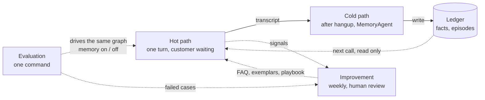

Ba chu kỳ khác nhau: hội thoại theo lượt, ghi nhớ theo cuộc, học theo tuần. Vì tách rời được nên baseline chỉ là một công tắc.

### 1b. Câu chuyện hai cuộc gọi

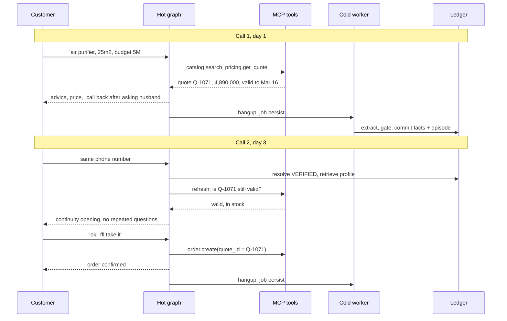

---

## 2. Kiến trúc triển khai

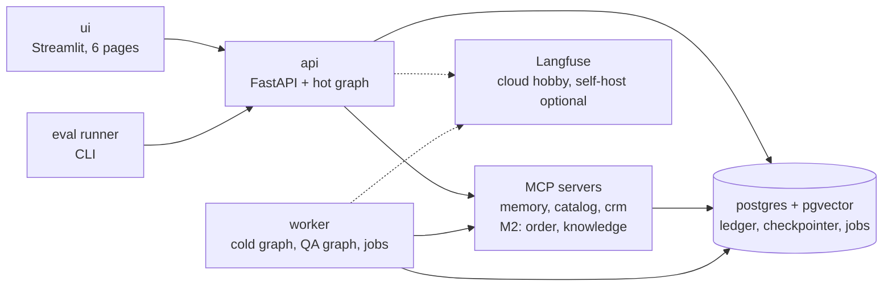

`make dev` cho M1: api và worker cùng một tiến trình, MCP qua stdio, chỉ Postgres trong Docker. `make up` cho M2: compose đầy đủ.

---

## 3. Trạng thái phiên và quyền

### 3a. Mỗi agent chỉ nhận một lát cắt của state

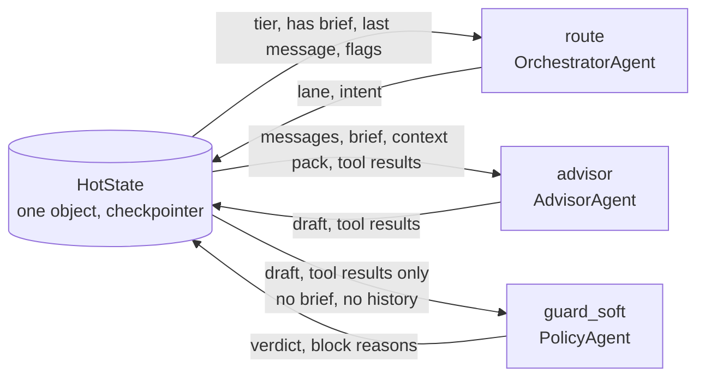

### 3b. Ai được ghi cái gì

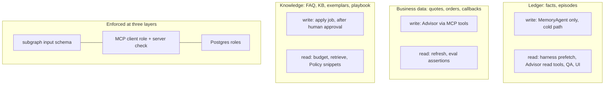

Bảng đầy đủ ở mục 3.3 của `flow.md`.

---

## 4. L0, tiếp nhận

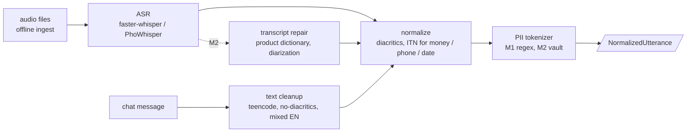

Audio và chat đi qua cùng một bộ chuẩn hóa, sau đó cùng một harness.

---

## 5. L1, danh tính

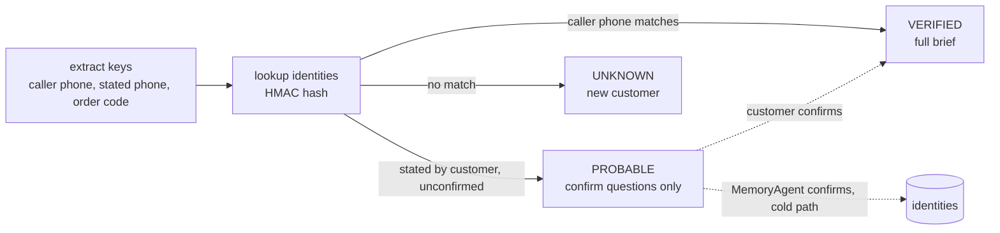

---

## 6. L2, sổ cái, nhánh đọc

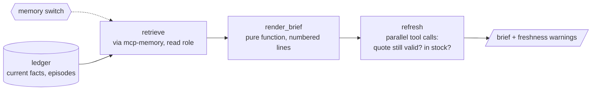

Công tắc tắt thì `retrieve` trả về rỗng và mọi thứ sau đó chạy như khách mới. Đó là baseline.

---

## 7. L2, cổng ghi, đường nguội

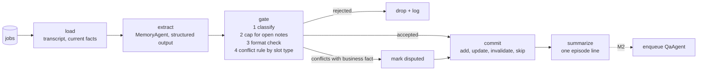

Luật thắng khi mâu thuẫn:

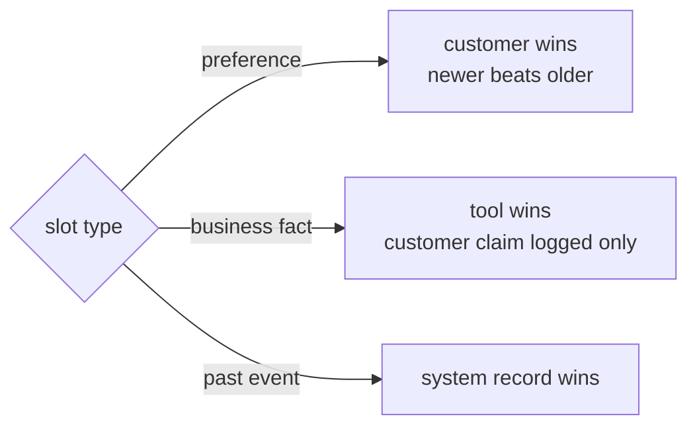

---

## 8. L3, graph nóng

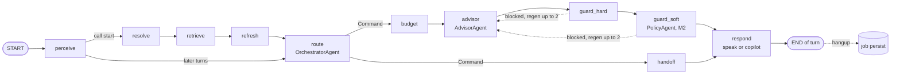

Không vẽ: `compact` (chạy trước `route` khi vượt ngưỡng token, M2), `safe_default` (khi hết trần sinh lại), `human_send` (chỉ ở copilot, xem hình 14). Đồng hồ ảo `now` nằm trong state, mọi node đọc từ đó.

---

## 9. OrchestratorAgent, node route

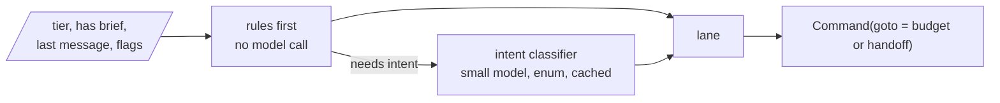

| Lane | When | Tools bound to Advisor |
|---|---|---|
| HANDOFF | tools down, customer asks for a human, Policy blocked twice | none |
| CLARIFY | low ASR confidence | none |
| CONFIRM_IDENTITY | tier PROBABLE | none |
| ORDER_SERVICE (M2) | order status, change size or address | order.status, order.update |
| OUT_OF_SCOPE | question with no FAQ / KB hit | none, so "no tool called" is assertable |
| CONTINUITY | VERIFIED with open blocker or valid quote | catalog, pricing, inventory, order.create, callback |
| NEW | everything else | same as CONTINUITY |

---

## 10. AdvisorAgent, subgraph

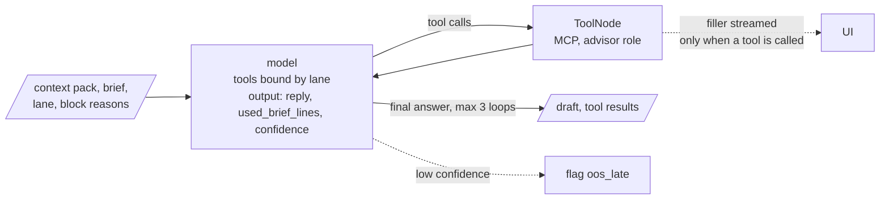

Chính sách tool: giá, khuyến mãi, tồn kho, giao hàng luôn tra tool; chính sách qua FAQ hoặc KB; thứ đã có trong brief không tra; xã giao không tra.

---

## 11. Guardrail và cảnh báo

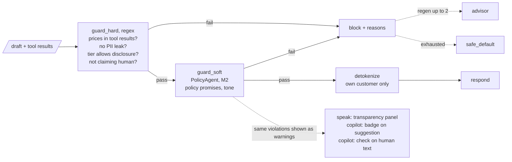

Cảnh báo không phải agent thứ sáu, nó là `violations` của PolicyAgent hiện ở ba chỗ.

---

## 12. Fallback

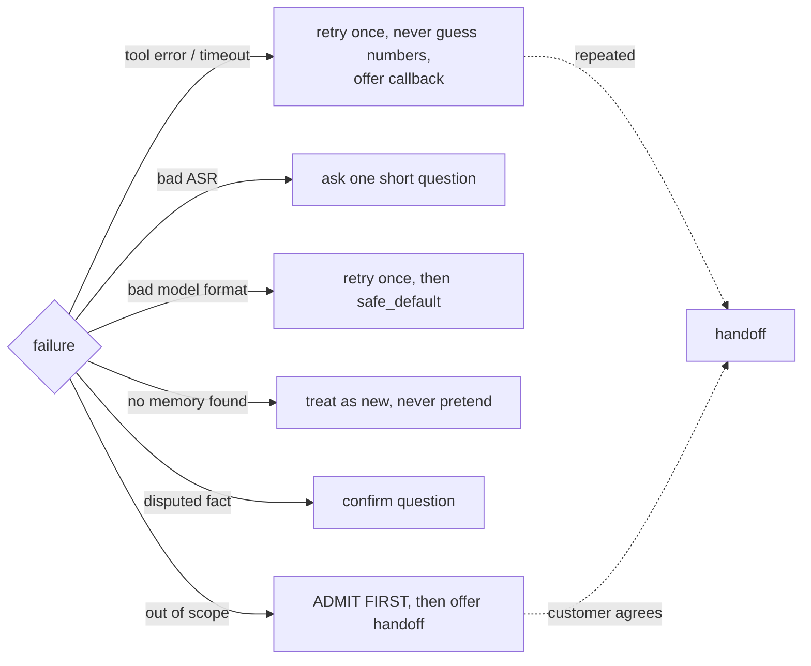

Câu nói cụ thể với khách cho từng ca ở bảng mục 12 của `flow.md`.

---

## 13. Handoff

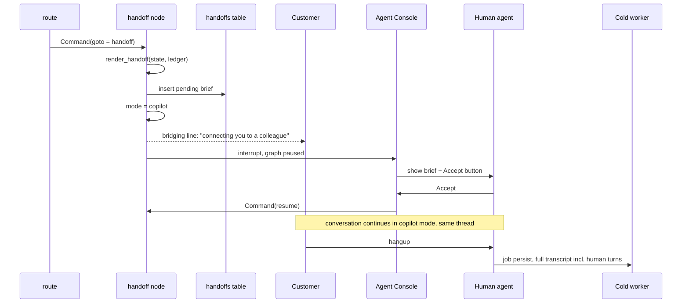

Handoff Brief chứa: khách là ai, sản phẩm với quote_id và giá, rào cản, cam kết (M2), fact tranh chấp, 3 lượt cuối, lý do chuyển, việc cần làm, link trace. Bàn giao ca là cùng renderer chạy trên danh sách callback đến hạn.

---

## 14. Copilot

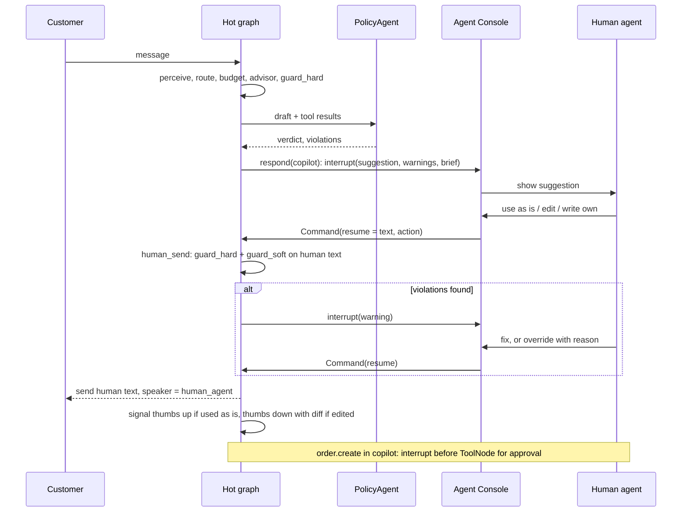

Eval luôn chạy mode speak; copilot chỉ là giá trị khác của tham số ở node cuối.

---

## 15. L4, MCP và phân quyền

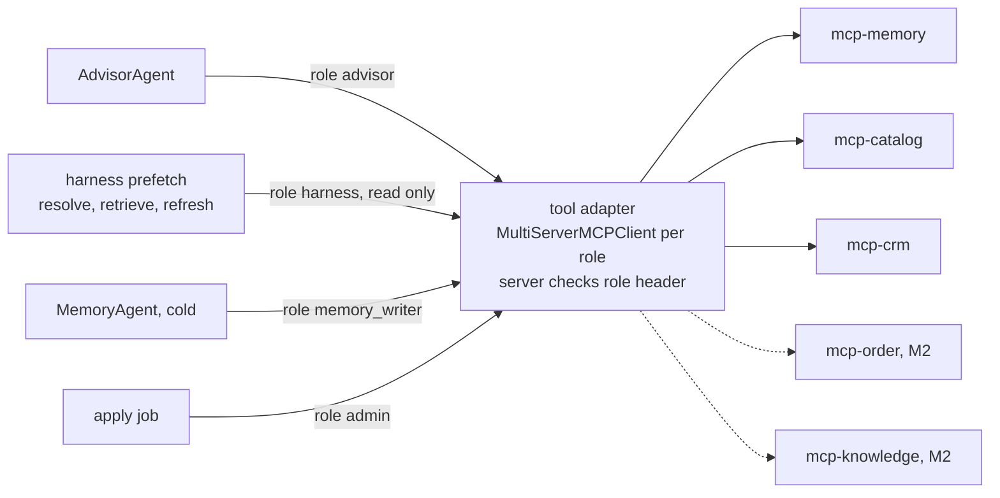

| Server | Read tools | Write tools |
|---|---|---|
| mcp-memory | get_profile, get_episodes, get_open_items, identity.find, M2 search_notes | commit_facts, commit_episode, confirm_identity, link_provisional, M2 delete_customer |
| mcp-catalog | catalog.search, inventory.check, pricing.get_quote (returns quote_id, valid_until) | |
| mcp-crm | crm.get_customer | order.create(quote_id), schedule.callback |
| mcp-order (M2) | order.status | order.update |
| mcp-knowledge (M2) | kb.search | kb.upsert (admin) |

`quote_id` là trục chống bịa giá: Advisor không nhớ giá, guard chỉ đối chiếu với tool results, `order.create` nhận `quote_id` nên server áp giá. Không dùng A2A vì lý do ở mục 15.4 của `flow.md`.

---

## 16. Truy vết

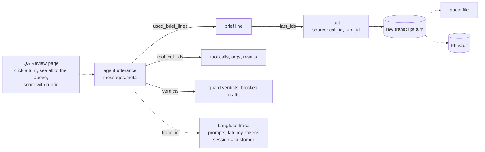

Bảng của mình là nguồn sự thật, Langfuse là màn hình soi. Trace chỉ chứa text đã tokenize.

---

## 17. L5, đánh giá

### 17a. Runner

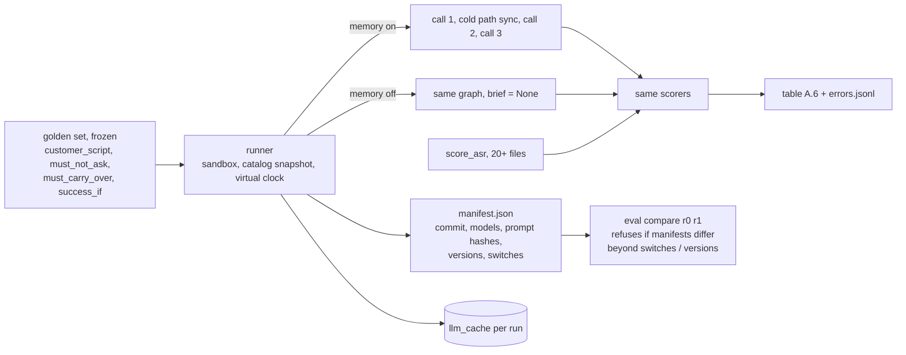

### 17b. Bốn bộ chấm

```mermaid
flowchart LR
    T[/"transcript + tool log"/] --> Q["question_classifier<br/>small model, temp 0, cached,<br/>accuracy reported on 50 labels"] --> M1["RQR"]
    T --> F["fact_usage_checker<br/>deterministic"] --> M2["CCR"]
    T --> A["assertion_runner"] --> M3["TSR"]
    A -.->|"graded_by = judge"| J["QaAgent judge<br/>binary rubric, kappa vs human"] --> M3
    T --> C["claim_extractor<br/>small model, temp 0, cached"] --> M4["HR, separate for price and promo"]
```

### 17c. Phía khách trong eval

```mermaid
flowchart LR
    A["agent turn"] --> Q{"question about a slot?"}
    Q -->|"open"| ANS["answer from script"]
    Q -->|"confirm"| CF["confirm reply"]
    Q -->|"no"| NX["next scripted line,<br/>or accept offer if buy_if_offered"]
    SIM["SimulatorAgent, M2<br/>persona, script facts only,<br/>patience drops on repeated questions"] -.->|"replaces this, same scenario file"| A
```

---

## 18. L6, cải tiến

### 18a. Knowledge Gap Loop, M1

```mermaid
flowchart LR
    S["signals<br/>out of scope, customer repeats,<br/>eval errors, outcomes, thumbs"] --> CL["collect + cluster"]
    CL --> PR[("proposals")]
    PR --> HR{"review page<br/>approve / reject"}
    HR -->|"approved"| AP["apply"]
    AP --> FQ[("faq_block vN+1<br/>M2: KB")]
    AP --> GS["growth set<br/>never the golden set"]
    FQ -.->|"into prompt via budget"| ADV["advisor"]
    CORP["conversation corpus + simulator runs"] -.->|"discovery source"| S
```

### 18b. Exemplar Bank, M2

```mermaid
flowchart LR
    WON["closed-won call"] --> PC{"policy_clean?<br/>guard_soft on every turn, HR = 0"}
    PC -->|"no"| DR["reject"]
    PC -->|"yes"| HR{"review"} --> EB[("exemplars")]
    EB --> SEL["select by objection type + persona,<br/>diversify"] --> RT["retrieve, last in budget priority"]
```

### 18c. Reflection và playbook, M2

```mermaid
flowchart LR
    Q["QaAgent score"] --> W{"worth learning?<br/>lost deal, objection, OOS, disputed"}
    W -->|"no"| SK["skip"]
    W -->|"yes"| RF["reflect<br/>structured lesson"] --> CK{"schema + policy check"}
    CK -->|"fail"| DR["discard"]
    CK -->|"pass"| HR{"review"} --> PB[("playbook<br/>versioned entries")]
    PB -.->|"metrics drop"| RV["revoke entry"]
```

### 18d. Vòng và quay lui

```mermaid
flowchart LR
    R0["R0: faq v0<br/>baseline + system"] --> R1["R1: faq v1"] --> R2["R2: + exemplars + playbook, M2"] --> R3["R3: faq v2, M2"]
    R2 --> AB["ablation per entry<br/>negative delta = revoke"]
    R1 -.->|"compare drops"| RB["rollback: version pointer"]
    GOLD[("golden set, frozen<br/>same manifest except versions")] --- R0
```

---

## 19. L7, giao diện

```mermaid
flowchart LR
    CH["Chat<br/>customer view"]
    AC["Agent Console<br/>Call Brief, memory timeline,<br/>transparency panel, handoff card,<br/>copilot suggestions, thumbs"]
    QA["QA Review<br/>trace + rubric + human scoring"]
    IM["Improvement<br/>proposals, versions, rollback"]
    DB["Dashboard, M2<br/>metrics by round, latency, cost"]
    SH["Shift handover<br/>due callbacks + briefs"]
    API["api"] --> CH
    API --> AC
    API --> QA
    API --> IM
    API --> SH
    REP["reports / manifests"] -.-> DB
```

---

## 20. Tương tác giữa các agent

```mermaid
flowchart LR
    OA["OrchestratorAgent"] -->|"Command, lane"| AA["AdvisorAgent"]
    OA -->|"Command"| HO["handoff to human"]
    AA -->|"draft + tool results only"| PA["PolicyAgent, M2"]
    PA -->|"block reasons, not just pass / fail"| AA
    PA -->|"pass"| OUT(["respond"])
    OUT -->|"transcript at hangup"| MC["MemoryAgent, cold, WRITE"]
    MC -.->|"next call, read by harness,<br/>not through MemoryAgent"| AA
    MC -.-> QA["QaAgent, cold, SCORE<br/>outside the creation path"]
    ST[("one HotState")] --- OA
    ST --- AA
```

Không agent nào vừa tạo vừa tự duyệt. Giá trị của tách nằm ở chỗ agent thứ hai nhận ít thông tin hơn.

---

## 21. Kiểm kê

```mermaid
flowchart LR
    subgraph M1["M1: 3 agents"]
        A1["OrchestratorAgent"] --- A2["AdvisorAgent"] --- A3["MemoryAgent"]
    end
    subgraph M2["M2: +2"]
        A4["PolicyAgent"] --- A5["QaAgent = judge + reflect"]
    end
    subgraph EV["eval only, M2"]
        A6["SimulatorAgent"]
    end
    subgraph CODE["code nodes, no model"]
        N1["perceive, resolve, retrieve, refresh, budget,<br/>guard_hard, safe_default, respond, handoff<br/>M2: compact, human_send"]
    end
    subgraph JOBS["jobs"]
        J1["persist, collect, cluster, apply<br/>M2: rollback, ablation"]
    end
```

Slide M1 chỉ trình bày khối M1 và khối code nodes.
